# shell初试

- 在控制台当中echo $0显示当中使用的shell名称

  - bash前边的横线表示当前是用户的登录shell

  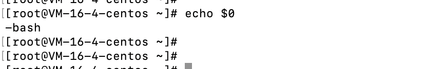

  - 在shell当中展示的是当前shell文件名称

- 查看子shell之间的嵌套关系，执行`ps --forest `，也可以通过`ps -ef `展示的内容的pid ,ppid之间的关系查看

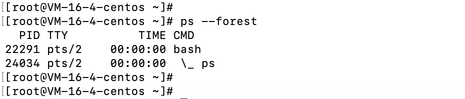

- 查看是否生成了子shell，执行`echo $BASH_SUBSHELL`
  - 如果返回值为0，说明没有子shell
  - 如果返回值大于1，说明存在子shell

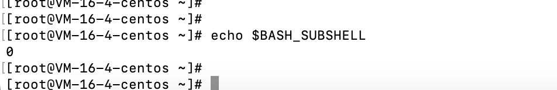

- 命令执行记录保存在`/root/.bash_history`下，
  - 如果需要清除历史命令，执行`history -c `，在执行 `history -a`，清除`.bash_history`

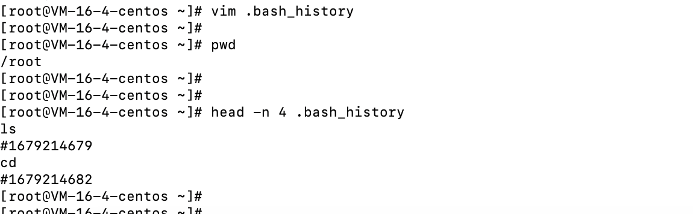

- 命令别名，查看当前linux系统使用的命令别名，执行`alias -p`
  - 添加别名`alias alias='命令'`；
  - 移除别名`unalias alias-name`，删除指定的别名。

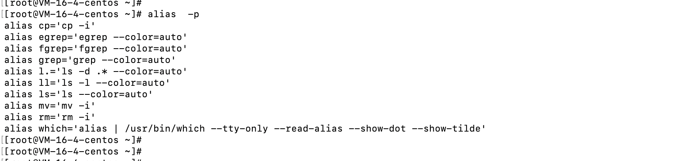

- 查看全局环境变量，执行`env`或者`printenv`
  - 设置全局环境变量，执行`export aa="aa"`
  - 删除变量，执行`unset 变量名称`

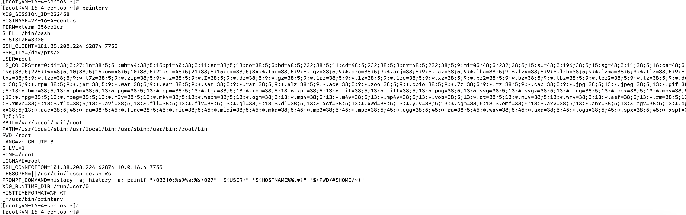

- 启动bash shell
  - 登录时作为默认登录shell
    - 默认会从5个不同的启动文件中读取命令，
      - /etc/profile
        - bash shell默认的朱启动文件，
        - 大部分linux系统只用到了以下四个配置文件当中的两个。
      - $HOME/.bash_profile
      - $HOME/.bashrc
      - $HOME/.bash_login
      - $HOME/.profile
  - 作为交互式shell，通过生成子shell启动
  - 作为运行脚本的非交互式shell

- 数组变量，类似：

  - 数组变量默认展示第一个变量
  - 展示所有的数组变量，执行`echo ${aa[*]}`

  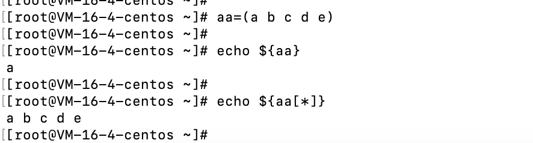

  - 删除数组中某个值，`unset aa[2]`

  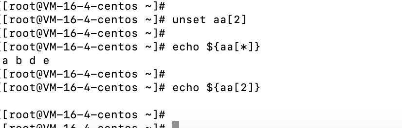

  - 删除整个数组，执行`unset aa`

  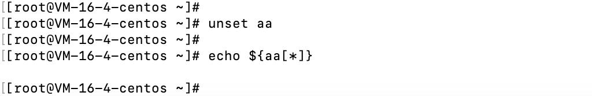

  - 

- 处理命令行的输入，例如执行`fdisk /dev/vda`，需要手动输入，可以执行`echo "n\n\n\n\n\nw | fdisk /dev/vda"`

  - 查看linux原来的系统盘

  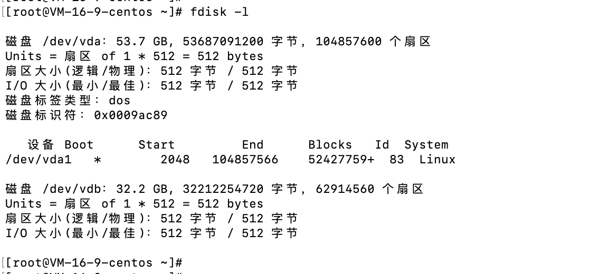

  - 执行命令之后，命令`echo -e "n\n\n\n\n\nw" | fdisk /dev/vdb `

  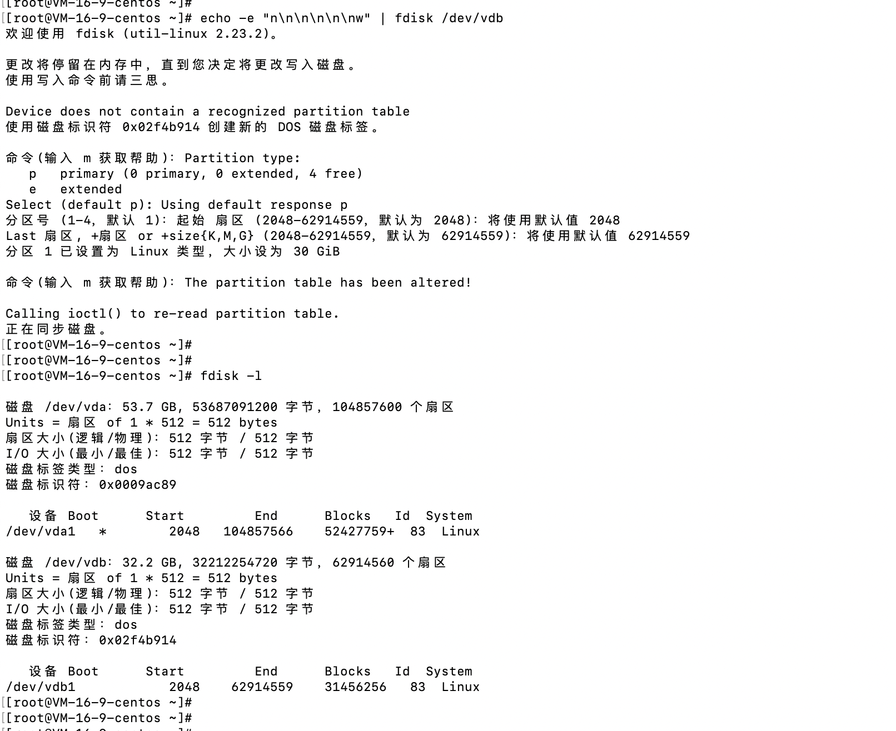

- $()和${}的区别

  - $()：表示cmd命令
  - ${}：表示var变量

- 