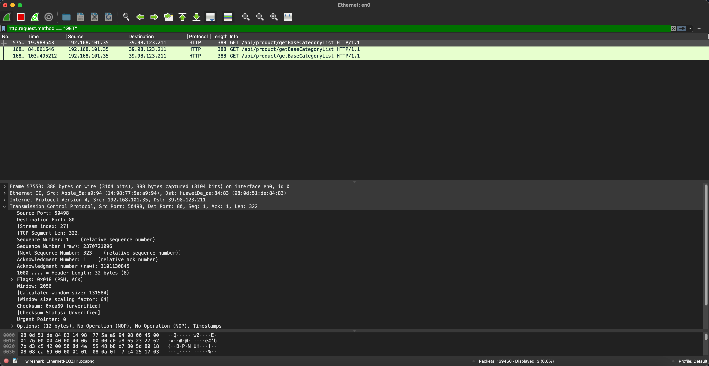
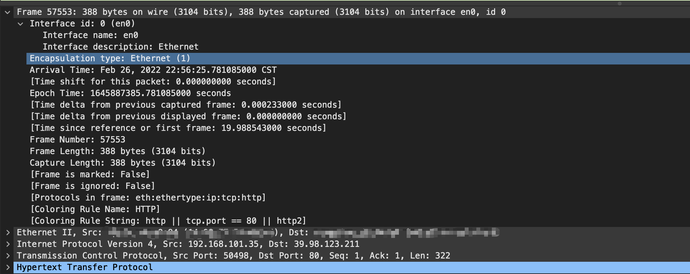
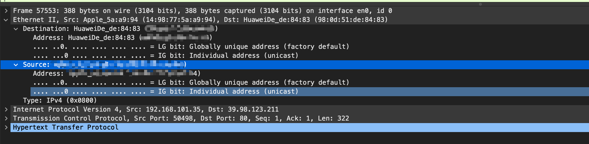
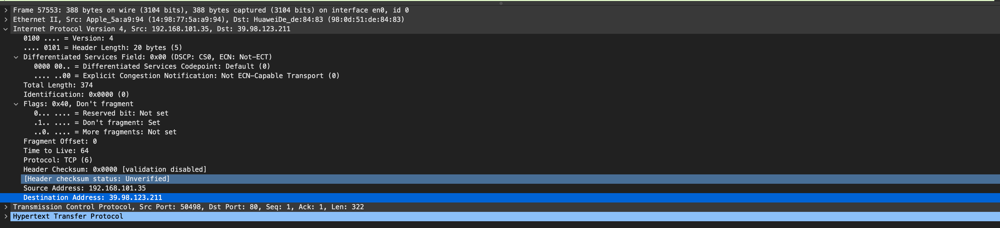
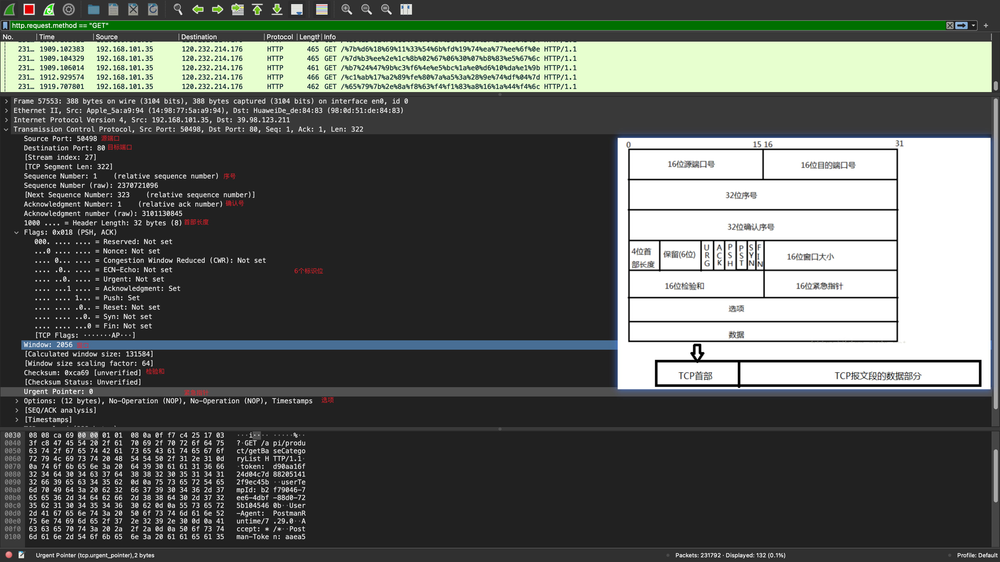
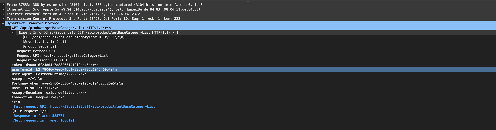

# wireshark抓包分析

# 使用工具

- wireshark
- postman

# postman测试

- 测试接口地址为：http://39.98.123.211/api/product/getBaseCategoryList
- 完整的curl为：

```curl
curl --location --request GET 'http://39.98.123.211/api/product/getBaseCategoryList' \
--header 'token: d90aa16f24d04c7d882051412f9ec45b' \
--header 'userTempId: b2f79046-7ee6-4dbf-88d0-725b1045460b'
```

# wireshark抓包

截图如下 ：



# 详细信息

- Frame 物理层的数据帧
- Ethernet II 数据链路层以太网帧头部信息
- Internet Protocol Version 4 网际层 IP 包头部信息
- Transmission Control Protocol 传输层的数据段头部信息
- Hypertext Transfer Protocol 应用层的信息，此处是 HTTP 协议

# 逐层分析

## Frame

wireshakr截图如下：



## Ethernet II

wireshark截图如下：



以太网帧头部含义如下：

- Destination: 目标MAC地址
- Source: 源MAC地址

## Internet Protocol Version 4

wireshark截图如下：



IP数据包的格式：

- 版本：指IP协议的版本。
- 首部长度：IP首部长度。
- 区分服务：
- 总长度：指首部和数据之和的长度。
- 标识：一个唯一的标识数字，用来标识一个数据报或者被分片数据报的次序。
- 标志： 用来标识一个数据包是否是一组分片数据包的一部分。 最低位MF（More Fragment）。当MF=1表示后面“还有分片”的数据包，MF=0表示这已经是最后一个分片数据了，中间位DF（Dont Fragment）不能分片，只有当DF=0时，才允许分片
- 片偏移： 一个数据包其中的分片，用于重新组装数据用
- 生存时间：用来定义数据包的生存周期
- 协议：用来识别在数据包序列中上层协议数据包的类型
- 首部检验和：一个错误的检测机制，确保IP头部没有被修改
- 源地址：发送端的IP地址
- 目标地址：数据包目的的IP地址

## Transmission Control Protocol

wireshark截图如下：



TCP报文段的首部格式：

- 源端口号：数据发起者的端口号，2字节
- 目的端口号：数据接收者的端口号，2字节
- 序号：4字节的序列号，由发送方使用
- 确认序号：4字节的确认号，是接收数据方期望收到发送方的下一个报文段的序号，因此确认序号应当是上次已成功收到数据字节序号加1。
- 首部长度：首部中4字节字的数目
- 保留：6bit, 均为0
- 紧急URG：当URG=1时，表示报文段中有紧急数据，应尽快传送。
- 确认ACK：ACK = 1时代表这是一个确认的TCP包，取值0则不是确认包。
- 推送PSH：当发送端PSH=1时，接收端尽快的交付给应用进程。
- 复位（RST）：当RST=1时，表明TCP连接中出现严重差错，必须释放连接，再重新建立连接。
- 同步SYN：在建立连接是用来同步序号。SYN=1， ACK=0表示一个连接请求报文段。SYN=1，ACK=1表示同意建立连接。
- 终止FIN：FIN=1时，表明此报文段的发送端的数据已经发送完毕，并要求释放传输连接。
- 窗口：用来控制对方发送的数据量，通知发放已确定的发送窗口上限。
- 检验和：该字段检验的范围包括首部和数据这两部分。由发端计算和存储，并由收端进行验证。
- 紧急指针：紧急指针在URG=1时才有效，它指出本报文段中的紧急数据的字节数。
- 选项：长度可变，最长可达40字节

## Hypertext Transfer Protocol

wireshark截图如下：



应用层协议字段含义如下：

- 请求报文由三部分组成：请求行，首部行，实体主体
- 第一行由：方法类型，URL，版本组成
- 首部行：用来说明浏览器，服务器或者报文主体的一些信息


