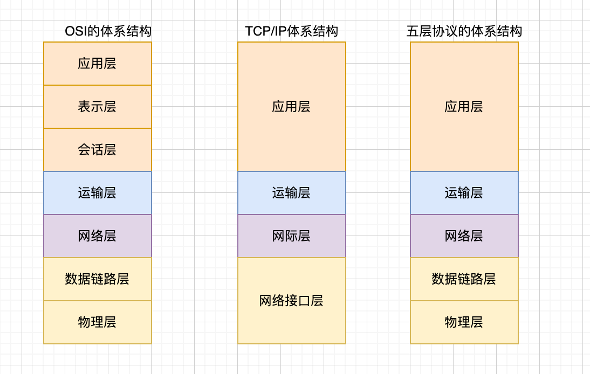
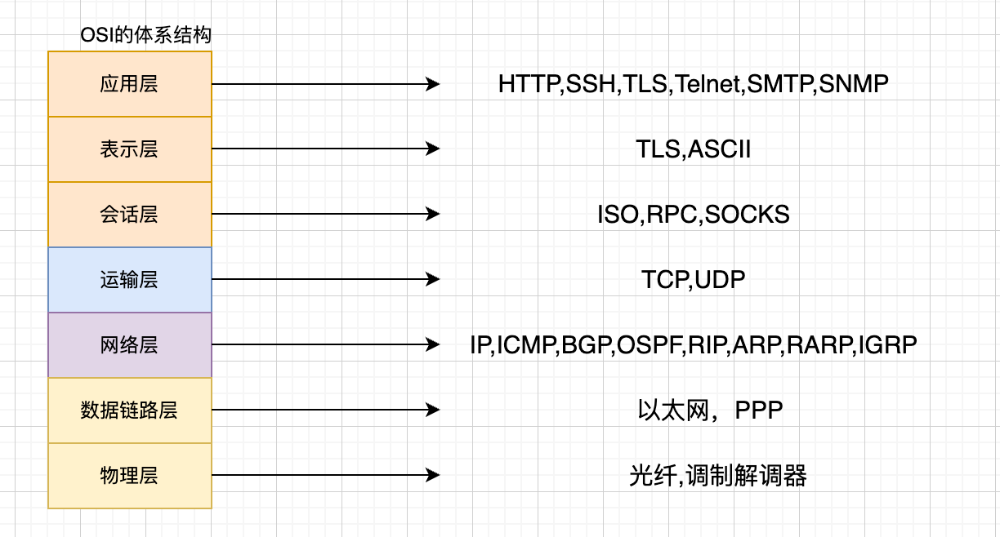
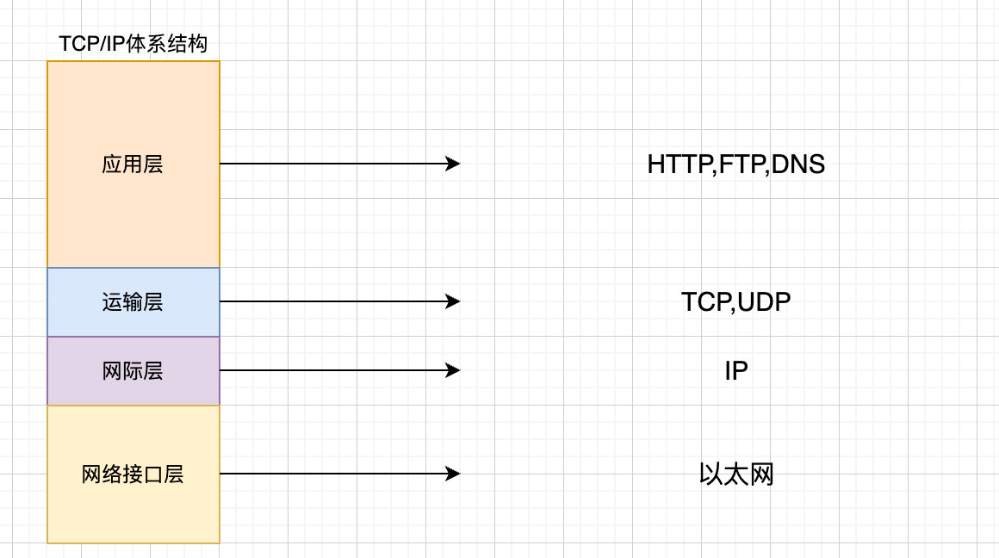
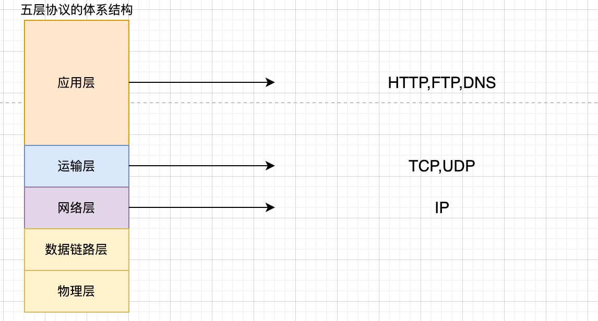
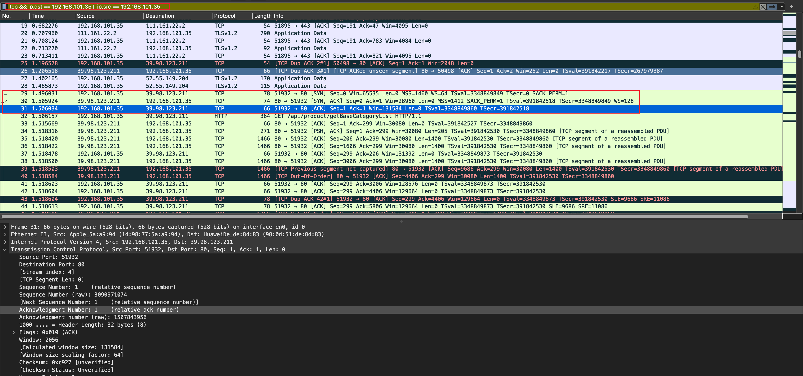
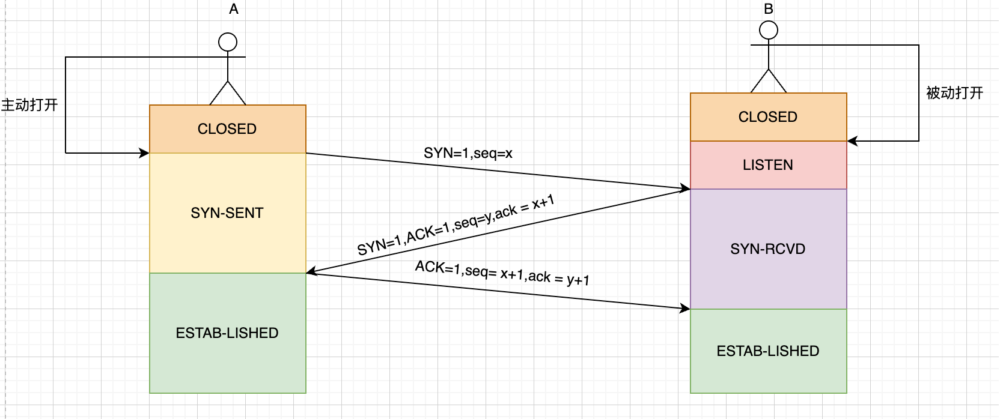
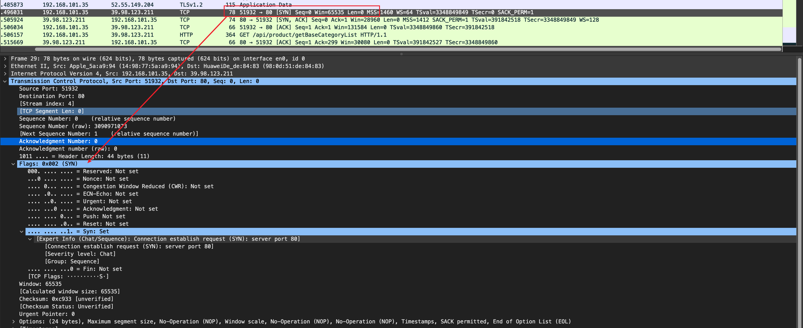
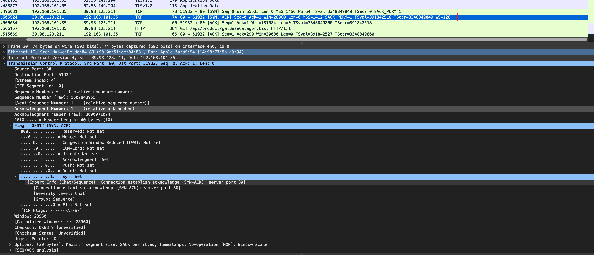
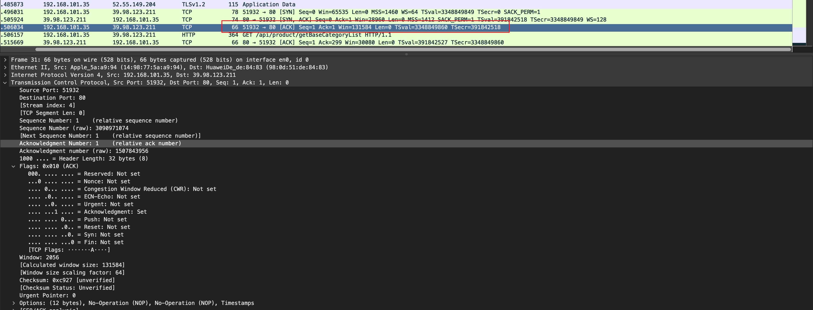

# wireshark01-抓包三次握手

# 计算机网络体系结构

# OSI的体系结构

# TCP/IP的协议结构

# 五层协议的体系结构

# 总体截图：

# 三次握手的流程图

# 第一次握手

截图解释，并介绍第一次握手：

- 第一次握手，客户端发起请求，SYN报文段置1，序号=x，也就是上述截图的sequence number = 0
- 第一次握手，客户端状态由CLOSEDS状态转变为SYN-SENT同步发送状态。
- 服务端状态也转变为LISTEN状态

# 第二次握手

截图解释，并介绍第二次握手：

- 第二次握手，服务端报文段SYN,ACK置1，也就是上述截图的Flags中，Syn:Set，Acknowledgment:Set
- 确认号是第一次握手的seq+1，也就是ackowledgment number = 第一次握手的sequence number + 1, 等于上次的 0 + 1，同时也为自己选择了一个序号：sequence number = 0
- 服务端状态也由LISTEN状态转变为SN-RCVD状态

# 第三次握手

截图解释，并介绍第三次握手：

- 客户端收到服务端的消息，客户端向服务端发起确认，将报文段ACK置1，
- 确认号：第二次握手的sequence number + 1，序号：第二次握手的ackowledgment number

# 参考资料

- https://zh.wikipedia.org/wiki/TCP/IP%E5%8D%8F%E8%AE%AE%E6%97%8F
- 计算机网络（第六版） 谢希仁著