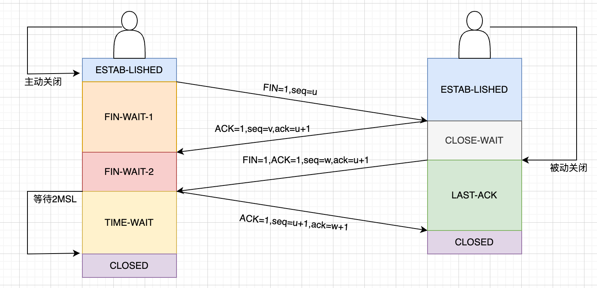
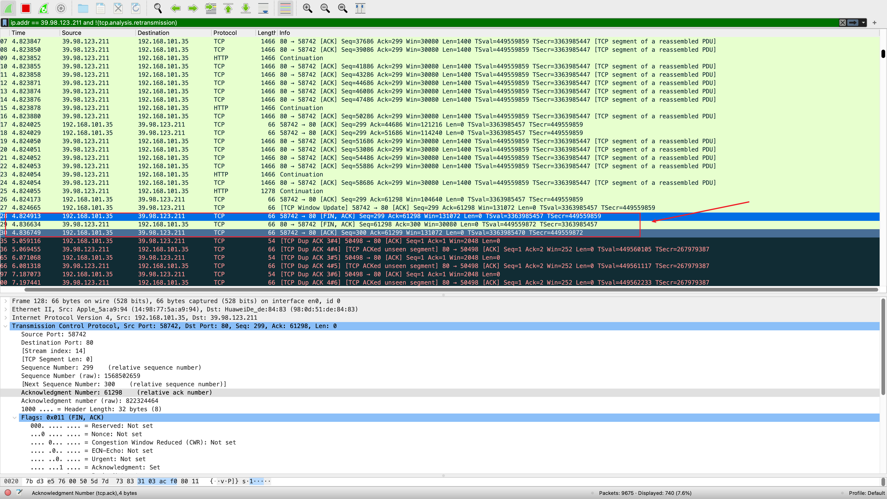
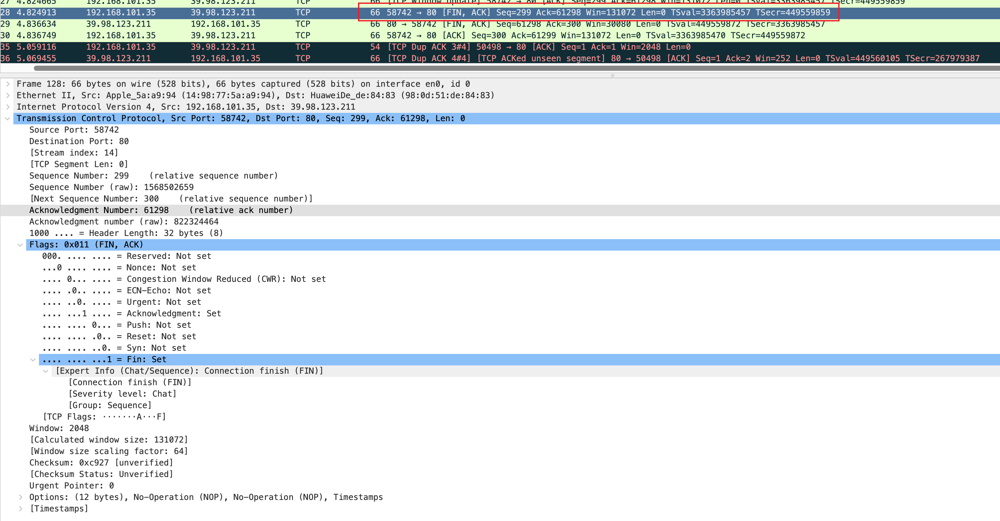
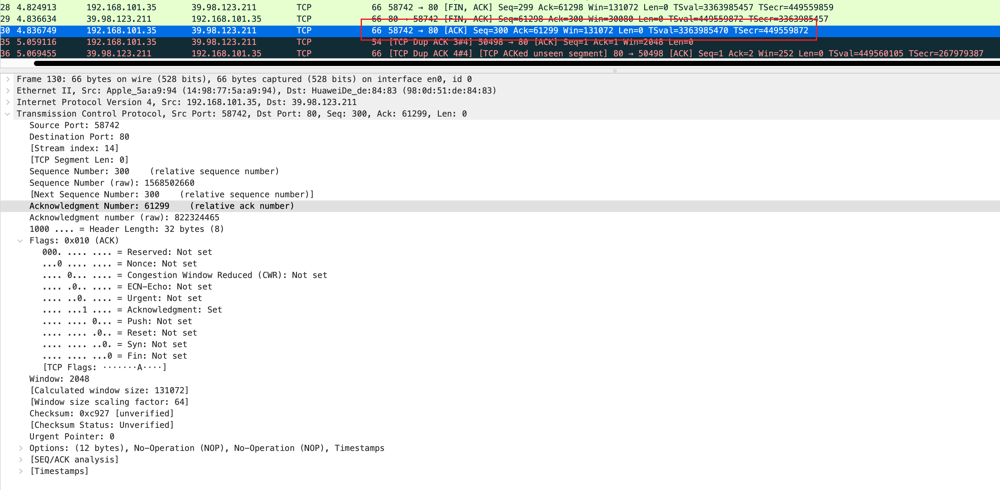

# wireshark抓包与四次挥手分析

# 四次挥手流程图

# wireshark三次挥手

- 第一次挥手：主机向服务器发送FIN+ACK
- 第二次挥手：服务器向主机发送FIN + ACK
- 第三次挥手：主机向服务器发送ACK

wireshark抓包图如下：

# 分析三次挥手

## 第一次挥手

- 

## 第二次挥手

- 第二次挥手合并了第二次挥手和第三次挥手

## 第三次挥手

- TODO 

