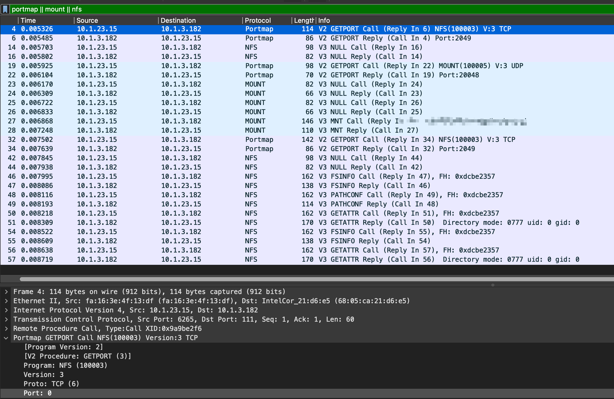

# Wireshark03-nfs协议挂载

[toc]

# nas挂载抓包

# nas挂载流程

- 客户端请求端口地址
- 服务端返回端口
- 客户端尝试连接
- 服务端返回连接信息
- 客户端请求挂载端口
- 服务端返回挂载端口
- 客户端尝试挂载
- 服务端返回挂载信息
- 客户端尝试挂载共享地址
- 服务端返回共享地址挂载情况
- 客户端请求文件信息
- 服务端返回文件信息

# 分步详细讲解

- 客户端4号包：我想连接NFS进程，应该使用那个那个端口？
- 服务端6号包：返回端口，端口是2049
- 客户端14号包：那我试一下NFS进程能否连上
- 服务端16号包：收到了，能连上
- 客户端19号包：我想连接你的mount服务，应该用哪个端口呀？
- 服务端22号包：我的mount的端口号是20048
- 客户端23号包：那我试一下mount进程能否连上。
- 服务端24号包：收到了，能连上。
- 客户端27号包：我要挂载/XXX共享目录。
- 服务端28号包：你的请求被批准了。以后请用file handle 0xdcbe2357 来访问本目录。
- 323，34，42，44又走了一遍连接的步骤
- 客户端46号包：我想看看这个文件系统的属性
- 服务端47号包：给，都在这里
- 客户端48号包：想要获取文件信息
- 服务端49号包：文件信息给你
- 客户端50号包：想要获取文件属性
- 服务端51号包：文件属性给你

