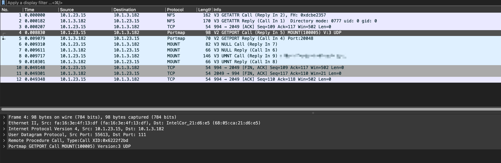

# Wireshark05-nfs协议-unmout过程

[toc]

# 抓包图

# 总流程

- 获取挂载端口
- 返回挂载端口
- 尝试挂载
- 返回挂载结果
- 卸载NAS共享路径
- 返回卸载信息

# 详细步骤

- 客户端4号包：获取挂载端口
- 服务端5号包：返回挂载端口，端口是10048
- 客户端6号包：尝试挂载，响应包是7号包
- 服务端7号包：返回挂载结果，请求包是6号包
- 客户端8号包：卸载NAS共享路径，共享路径是/XXX
- 服务端9号包：返回卸载信息

