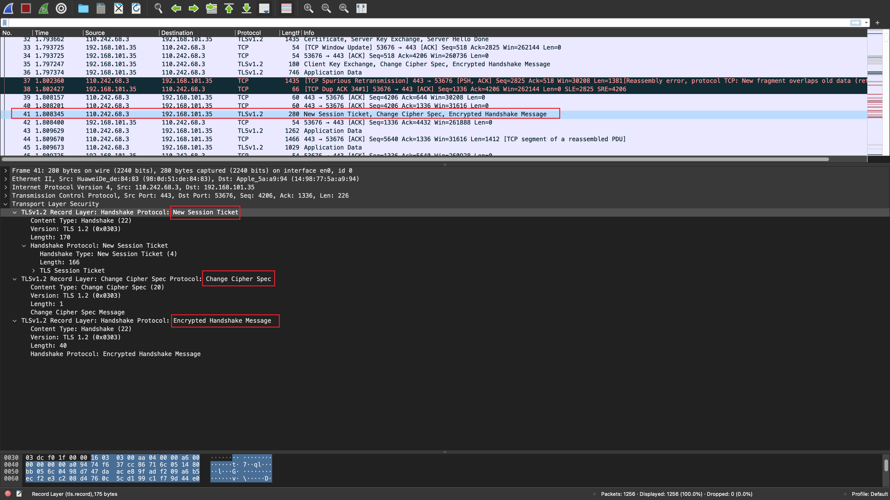

# TLS/SSL协议分析

[toc]

# TLS/SSL协议

## 是什么

- TLS 协议主要旨在通过使用证书在两个或多个通信计算机应用程序之间提供加密，包括隐私（机密性）、完整性和真实性。它运行在应用层，它本身由两层组成：TLS 记录和 TLS握手协议。TLS是SSL的升级版。
- 安全套接字层**( **SSL)
- 使用 TLS协议以一种旨在防止窃听和篡改的方式通过网络进行通信

## 运行过程

客户端和服务器就用于建立连接安全性的各种参数达成一致：

- 当客户端连接到启用 TLS 的服务器请求安全连接并且客户端显示支持的密码套件（密码和哈希函数）列表时，握手开始。
- 从这个列表中，服务器选择一个它也支持的密码和散列函数，并将决定通知客户端。
- 然后服务器通常以数字证书的形式提供标识。证书包含服务器名称、保证证书真实性的可信证书颁发机构)(CA) 以及服务器的公共加密密钥。
- 客户端在继续之前确认证书的有效性。
- 要生成用于安全连接的会话密钥，客户端可以：
  - 用服务器的公钥加密一个随机数（*PreMasterSecret*）并将结果发送到服务器（只有服务器应该能够用它的私钥解密）；然后双方使用随机数生成唯一的会话密钥，用于后续会话期间的数据加密和解密
  - 使用Diffie-Hellman 密钥交换安全地生成一个随机且唯一的会话密钥用于加密和解密，该密钥具有前向保密的附加属性：如果服务器的私钥在未来被泄露，它不能用于解密当前会话，即使会话被第三方拦截和记录。

## 客户端和服务器之间连接属性

- 该连接是私有的（或*安全*的），因为使用对称密钥算法来加密传输的数据。这种对称加密的密钥是为每个连接唯一生成的，并且基于会话开始时协商的共享密钥。服务器和客户端在传输第一个数据字节之前协商使用哪种加密算法和加密密钥的详细信息（见下文）。共享秘密的协商是安全的（协商的秘密对于窃听者来说是不可用的，并且无法获得，即使是将自己置于连接中间的攻击者）和可靠的（任何攻击者都不能在协商期间修改通信而不被检测到）。
- 可以使用公钥密码术来验证通信方的身份。此身份验证对于服务器是必需的，对于客户端是可选的。
- 连接是*可靠*的，因为传输的每条消息都包括使用消息验证码的消息完整性检查，以防止在传输过程中未检测到的数据丢失或更改

# wireshark抓包如下

# 基本 TLS 握手详细过程

下面是一个典型的连接示例，说明了服务器（但不是客户端）通过其证书进行身份验证 的握手

1. 谈判阶段：
   - 1.1.客户端发送一个**ClientHello**消息，指定它支持的最高 TLS 协议版本、一个随机数、建议的密码套件列表和建议的压缩方法。如果客户端试图执行恢复握手，它可能会发送一个*会话 ID*。如果客户端可以使用应用层协议协商，它可能包括支持的应用[协议列表，例如HTTP/2。
   - 1.2.服务器以**ServerHello**消息进行响应，其中包含客户端提供的选择中选择的协议版本、随机数、密码套件和压缩方法。为了确认或允许重新握手，服务器可以发送一个*会话 ID*。选择的协议版本应该是客户端和服务器都支持的最高版本。例如，如果客户端支持 TLS 1.1 版本，服务器支持 1.2 版本，则应选择 1.1 版本；不应该选择 1.2 版。
   - 1.3.服务器发送其**证书**消息（取决于所选的密码套件，这可能会被服务器省略）
   - 1.4.服务器发送它的**ServerKeyExchange**消息（取决于选择的密码套件，这可能被服务器省略）。此消息发送给所有DHE、ECDHE和 DH_anon 密码套件。
   - 1.5.服务器发送一个**ServerHelloDone**消息，表明它已经完成了握手协商。
   - 1.6.客户端使用**ClientKeyExchange**消息进行响应，该消息可能包含*PreMasterSecret*、公钥或任何内容。（同样，这取决于选择的密码。）这个*PreMasterSecret*是使用服务器证书的公钥加密的。
   - 1.7.客户端和服务器然后使用随机数和*PreMasterSecret*来计算一个共同的秘密，称为“主秘密”。此连接的所有其他密钥数据（会话密钥，例如IV、对称加密密钥、MAC密钥均来自此主密钥（以及客户端和服务器生成的随机值），它通过精心设计的伪随机函数。
2. 客户端现在发送一个ChangeCipherSpec记录，本质上是告诉服务器，“从现在开始我告诉你的一切都将被验证（如果服务器证书中存在加密参数，则加密）。” ChangeCipherSpec 本身就是一个内容类型为 20 的记录级协议。
   - 客户端发送经过身份验证和加密的**Finished**消息，其中包含先前握手消息的哈希和 MAC。
   - 服务器将尝试解密客户端的*Finished*消息并验证哈希和 MAC。如果解密或验证失败，则认为握手失败，应断开连接。
3. 最后，服务器发送一个ChangeCipherSpec，告诉客户端：“从现在开始，我告诉你的一切都将被验证（并且加密，如果协商加密的话）。”
   - 服务器发送其经过身份验证和加密的**Finished**消息。
   - 客户端执行与服务器在上一步中执行的相同的解密和验证过程。
4. 应用阶段：此时，“握手”完成并启用应用协议，内容类型为 23。客户端和服务器之间交换的应用消息也将像*完成*消息一样经过身份验证和可选加密。否则，内容类型将返回 25，客户端将不会进行身份验证。s

# 结合抓包分析

- 1.1    ->  wireshark当中26号包，指定TLS支持的最高版本，随机数，会话ID，建议的密码套件列表和压缩方法
  - 由于客户端对一些加解密算法的支持程度不一样，但是SSL/TLS协议传输过程中必须要求客户端与服务器端使用相同的加解密算法。客户端发送自己支持的密码套件列表，

- 1.2.客户端提供的选择中选择的协议版本、随机数、密码套件和压缩方法，wireshark当中28号包

- 1.3.服务器发送其**证书**消息，wireshark截图当中显示的32号包

- 1.4.服务器发送它的**ServerKeyExchange**消息，wireshark截图当中显示的32号包

- 1.5.服务器发送一个**ServerHelloDone**消息，表明它已经完成了握手协商。wireshark截图当中显示的32号包

- 1.6.客户端使用**ClientKeyExchange**消息进行响应，wireshark截图当中显示的35号包

- 最后，服务器发送一个ChangeCipherSpec，告诉客户端。wireshark截图当中显示的41号包

- 应用阶段：此时，“握手”完成并启用应用协议，内容类型为 23。客户端和服务器之间交换的应用消息也将像*完成*消息一样经过身份验证和可选加密。

 基本TLS握手结束

# 参考内容

- 维基百科：https://en.wikipedia.org/wiki/Transport_Layer_Security【重点】
