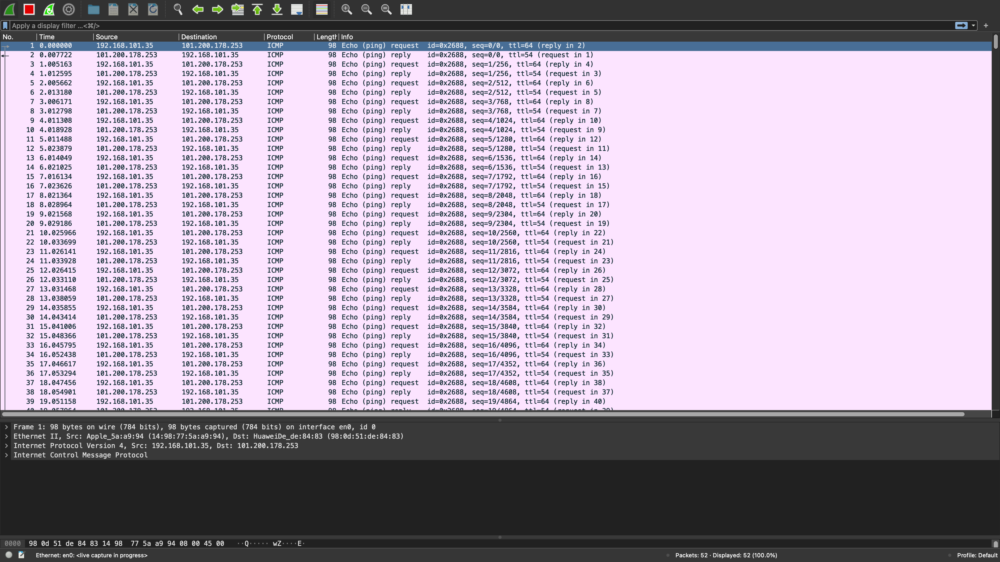
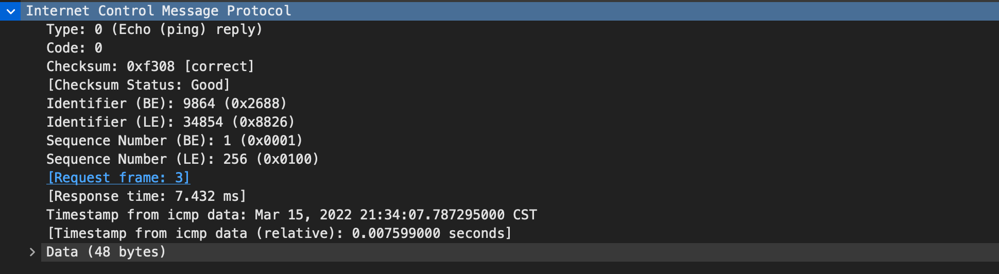
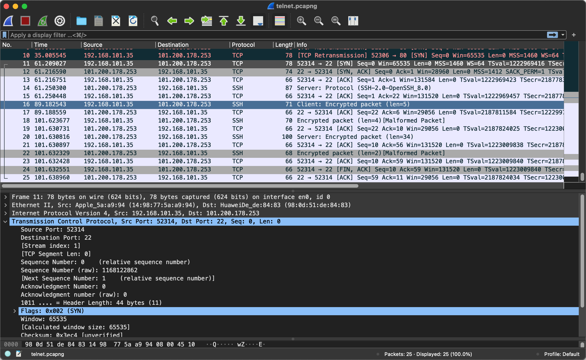

# PING和Telnet

# 缘由

- 今天申请虚拟IP，本地host映射域名，发现访问域名404，但是使用原有提供的IP和端口访问可以访问
- 本地cmd测试，ping虚拟IP不可以ping，telnet虚拟IP和端口可以测通
- 之前一直使用这两个命令，一直没有太理解，晚上回来接着这次机会好好研究一下

# PING和Telnet的不同

- PING使用 了ICMP协议，ICMP全程是：互联网控制消息协议**（英语：**I**nternet **C**ontrol **M**essage **P**rotocol，缩写：**ICMP）是[互联网](https://zh.wikipedia.org/wiki/互联网)协议族的核心协议之一
- ICMP协议它用于[网际协议](https://zh.wikipedia.org/wiki/网际协议)（IP）中发送控制消息，**提供可能发生在通信环境中的各种问题反馈**
- 依靠IP来完成它的任务，它是IP的主要部分。它与传输协议（如[TCP](https://zh.wikipedia.org/wiki/传输控制协议)和[UDP](https://zh.wikipedia.org/wiki/用户数据报协议)）显著不同：它一般不用于在两点间传输数据
- telnet 命令常用于远程连接与管理目标主机，或查看某个目标主机的某个TCP端口是否开放。
- telnet使用的是TCP协议
- PING主要用于检查主机和服务器之间的网络是否通畅，或者测试网络质量。telnet测试服务器的某个端口是否开通

# 抓包分析

## PING命令

抓包截图如下：

- 可以看到PING命令，在wireshark抓包显示使用的是ICMP协议，底层是IP协议，

ICMP报文信息如下：

- Type:类型
- Code:编码
- Checksum：校验和

重要的就是这三个，表示的含义参考 https://zh.wikipedia.org/wiki/%E4%BA%92%E8%81%94%E7%BD%91%E6%8E%A7%E5%88%B6%E6%B6%88%E6%81%AF%E5%8D%8F%E8%AE%AE

## Telnet命令

抓包截图如下：

- 可以看到telnet连接服务器，抓包显示的信息，telnet使用的是TCP协议。

# 参考资料

- https://zh.wikipedia.org/wiki/%E4%BA%92%E8%81%94%E7%BD%91%E6%8E%A7%E5%88%B6%E6%B6%88%E6%81%AF%E5%8D%8F%E8%AE%AE

  

