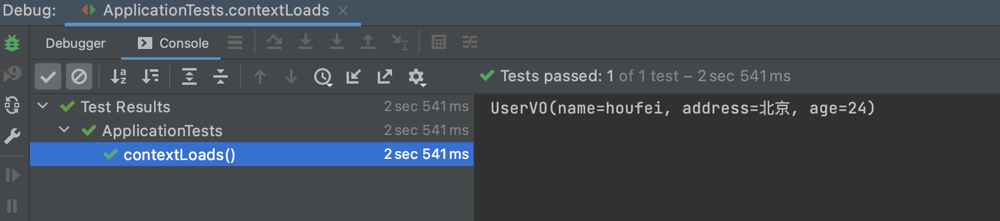

# mapstruct使用

[toc]

# mapstruct是什么

- 官方解释：https://github.com/mapstruct/mapstruct#what-is-mapstruct
- MapStruct 是一个 Java 注释处理器，用于为 Java bean 类生成类型安全和高性能的映射器。它使您免于手动编写映射代码，这是一项繁琐且容易出错的任务。生成器带有合理的默认值和许多内置的类型转换，但在配置或实现特殊行为时它会为您提供帮助。
- 与运行时工作的映射框架相比，MapStruct 具有以下优点：
  - 通过使用普通方法调用而不是反射来快速执行
  - 编译时类型安全。只能映射相互映射的对象和属性，因此不会将订单实体意外映射到客户 DTO 等。
  - 自包含代码——没有运行时依赖
  - 如果出现以下情况，请在构建时清除错误报告：
    - 映射不完整（并非所有目标属性都已映射）
    - 映射不正确（找不到合适的映射方法或类型转换）
  - 易于调试的映射代码（或可手动编辑——例如，在生成器中出现错误的情况下）
- 在编译时 MapStruct 将生成此接口的实现。 生成的实现使用纯 Java 方法调用来映射源对象和目标对象，即不涉及反射。 默认情况下，如果属性在源和目标中具有相同的名称，则它们会被映射，但是您可以使用 @Mapping 和一些其他注释来控制这个和许多其他方面。

# mapstruct基本使用

- 添加依赖

```xml
<dependency>
  <groupId>org.mapstruct</groupId>
  <artifactId>mapstruct</artifactId>
  <version>1.4.1.Final</version>
</dependency>
<dependency>
  <groupId>org.mapstruct</groupId>
  <artifactId>mapstruct-processor</artifactId>
  <version>1.4.1.Final</version>
</dependency>
```

- 新建接口

```java
package com.hfwas.springmvcsrcdemo.mapstruct;

import com.hfwas.springmvcsrcdemo.bean.User;
import com.hfwas.springmvcsrcdemo.dto.UserDTO;
import com.hfwas.springmvcsrcdemo.vo.UserVO;
import org.mapstruct.Mapper;

/**
 * @ClassName UserConvert
 * @Description
 * @Author <a href="hfwas1024@gmail.com">HFwas</a>
 * @Date: 7:46 下午
 * @Version: 1.0
 **/
@Mapper
public interface UserConvert {

    UserVO convertUserVO(User user);

    UserDTO convertUserDTO(User user);

}
```

- 新建测试类

```java
package com.hfwas.springmvcsrcdemo;

import com.hfwas.springmvcsrcdemo.bean.User;
import com.hfwas.springmvcsrcdemo.mapstruct.UserConvert;
import com.hfwas.springmvcsrcdemo.vo.UserVO;
import org.junit.jupiter.api.Test;
import org.mapstruct.factory.Mappers;
import org.springframework.boot.test.context.SpringBootTest;

import java.util.Arrays;

@SpringBootTest
class ApplicationTests {

    @Test
    void contextLoads() {
        User user = new User();
        user.setName("houfei");
        user.setAge(24);
        user.setAddress("北京");
        user.setRealName("张三");
        user.setRoleIdList(Arrays.asList("1","2","3"));
        UserConvert INSTANCE = Mappers.getMapper( UserConvert.class );

        UserVO userVO = INSTANCE.convertUserVO(user);
        System.out.println(userVO);
    }
}
```

- 测试结果



- 


# 使用

- 添加maven依赖

```xml
<properties>
    <org.mapstruct.version>1.4.2.Final</org.mapstruct.version>
</properties>
...
<dependencies>
    <dependency>
        <groupId>org.mapstruct</groupId>
        <artifactId>mapstruct</artifactId>
        <version>${org.mapstruct.version}</version>
    </dependency>
</dependencies>
...
<build>
    <plugins>
        <plugin>
            <groupId>org.apache.maven.plugins</groupId>
            <artifactId>maven-compiler-plugin</artifactId>
            <version>3.8.1</version>
            <configuration>
                <source>1.8</source>
                <target>1.8</target>
                <annotationProcessorPaths>
                    <path>
                        <groupId>org.mapstruct</groupId>
                        <artifactId>mapstruct-processor</artifactId>
                        <version>${org.mapstruct.version}</version>
                    </path>
                </annotationProcessorPaths>
            </configuration>
        </plugin>
    </plugins>
</build>
...
```

# 其他用法

## 类型不一致


## 字段名不一致


# mapping注解

## 相关代码

```java
@Repeatable(Mappings.class)
@Retention(RetentionPolicy.CLASS)
@Target({ ElementType.METHOD, ElementType.ANNOTATION_TYPE })
public @interface Mapping {

    /**
     * The target name of the configured property as defined by the JavaBeans specification. The same target property
     * must not be mapped more than once.
     * <p>
     * If used to map an enum constant, the name of the constant member is to be given. In this case, several values
     * from the source enum may be mapped to the same value of the target enum.
     *
     * @return The target name of the configured property or enum constant
     */
    String target();

    /**
     * The source to use for this mapping. This can either be:
     * <ol>
     * <li>The source name of the configured property as defined by the JavaBeans specification.
     * <p>
     * This may either be a simple property name (e.g. "address") or a dot-separated property path (e.g. "address.city"
     * or "address.city.name"). In case the annotated method has several source parameters, the property name must
     * qualified with the parameter name, e.g. "addressParam.city".</li>
     * <li>When no matching property is found, MapStruct looks for a matching parameter name instead.</li>
     * <li>When used to map an enum constant, the name of the constant member is to be given.</li>
     * </ol>
     * This attribute can not be used together with {@link #constant()} or {@link #expression()}.
     *
     * @return The source name of the configured property or enum constant.
     */
    String source() default "";

    /**
     * A format string as processable by {@link SimpleDateFormat} if the attribute is mapped from {@code String} to
     * {@link Date} or vice-versa. Will be ignored for all other attribute types and when mapping enum constants.
     *
     * @return A date format string as processable by {@link SimpleDateFormat}.
     */
    String dateFormat() default "";

    /**
     * A format string as processable by {@link DecimalFormat} if the annotated method maps from a
     *  {@link Number} to a {@link String} or vice-versa. Will be ignored for all other element types.
     *
     * @return A decimal format string as processable by {@link DecimalFormat}.
     */
    String numberFormat() default "";

    /**
     * A constant {@link String} based on which the specified target property is to be set.
     * <p>
     * When the designated target property is of type:
     * </p>
     * <ol>
     * <li>primitive or boxed (e.g. {@code java.lang.Long}).
     * <p>
     * MapStruct checks whether the primitive can be assigned as valid literal to the primitive or boxed type.
     * </p>
     * <ul>
     * <li>
     * If possible, MapStruct assigns as literal.
     * </li>
     * <li>
     * If not possible, MapStruct will try to apply a user defined mapping method.
     * </li>
     * </ul>
     * </li>
     * <li>other
     * <p>
     * MapStruct handles the constant as {@code String}. The value will be converted by applying a matching method,
     * type conversion method or built-in conversion.
     * <p>
     * </li>
     * </ol>
     * <p>
     * This attribute can not be used together with {@link #source()}, {@link #defaultValue()},
     * {@link #defaultExpression()} or {@link #expression()}.
     *
     * @return A constant {@code String} constant specifying the value for the designated target property
     */
    String constant() default "";

    /**
     * An expression {@link String} based on which the specified target property is to be set.
     * <p>
     * Currently, Java is the only supported "expression language" and expressions must be given in form of Java
     * expressions using the following format: {@code java(<EXPRESSION>)}. For instance the mapping:
     * <pre><code>
     * &#64;Mapping(
     *     target = "someProp",
     *     expression = "java(new TimeAndFormat( s.getTime(), s.getFormat() ))"
     * )
     * </code></pre>
     * <p>
     * will cause the following target property assignment to be generated:
     * <p>
     * {@code targetBean.setSomeProp( new TimeAndFormat( s.getTime(), s.getFormat() ) )}.
     * <p>
     * Any types referenced in expressions must be given via their fully-qualified name. Alternatively, types can be
     * imported via {@link Mapper#imports()}.
     * <p>
     * This attribute can not be used together with {@link #source()}, {@link #defaultValue()},
     * {@link #defaultExpression()}, {@link #qualifiedBy()}, {@link #qualifiedByName()} or {@link #constant()}.
     *
     * @return An expression specifying the value for the designated target property
     */
    String expression() default "";

    /**
     * A defaultExpression {@link String} based on which the specified target property is to be set
     * if and only if the specified source property is null.
     * <p>
     * Currently, Java is the only supported "expression language" and expressions must be given in form of Java
     * expressions using the following format: {@code java(<EXPRESSION>)}. For instance the mapping:
     * <pre><code>
     * &#64;Mapping(
     *     target = "someProp",
     *     defaultExpression = "java(new TimeAndFormat( s.getTime(), s.getFormat() ))"
     * )
     * </code></pre>
     * <p>
     * will cause the following target property assignment to be generated:
     * <p>
     * {@code targetBean.setSomeProp( new TimeAndFormat( s.getTime(), s.getFormat() ) )}.
     * <p>
     * Any types referenced in expressions must be given via their fully-qualified name. Alternatively, types can be
     * imported via {@link Mapper#imports()}.
     * <p>
     * This attribute can not be used together with {@link #expression()}, {@link #defaultValue()}
     * or {@link #constant()}.
     *
     * @return An expression specifying a defaultValue for the designated target property if the designated source
     * property is null
     *
     * @since 1.3
     */
    String defaultExpression() default "";

    /**
     * Whether the property specified via {@link #target()} should be ignored by the generated mapping method or not.
     * This can be useful when certain attributes should not be propagated from source or target or when properties in
     * the target object are populated using a decorator and thus would be reported as unmapped target property by
     * default.
     *
     * @return {@code true} if the given property should be ignored, {@code false} otherwise
     */
    boolean ignore() default false;

    /**
     * A qualifier can be specified to aid the selection process of a suitable mapper. This is useful in case multiple
     * mapping methods (hand written or generated) qualify and thus would result in an 'Ambiguous mapping methods found'
     * error. A qualifier is a custom annotation and can be placed on a hand written mapper class or a method.
     *
     * @return the qualifiers
     * @see Qualifier
     */
    Class<? extends Annotation>[] qualifiedBy() default { };

    /**
     * String-based form of qualifiers; When looking for a suitable mapping method for a given property, MapStruct will
     * only consider those methods carrying directly or indirectly (i.e. on the class-level) a {@link Named} annotation
     * for each of the specified qualifier names.
     * <p>
     * Note that annotation-based qualifiers are generally preferable as they allow more easily to find references and
     * are safe for refactorings, but name-based qualifiers can be a less verbose alternative when requiring a large
     * number of qualifiers as no custom annotation types are needed.
     *
     * @return One or more qualifier name(s)
     * @see #qualifiedBy()
     * @see Named
     */
    String[] qualifiedByName() default { };

    /**
     * Specifies the result type of the mapping method to be used in case multiple mapping methods qualify.
     *
     * @return the resultType to select
     */
    Class<?> resultType() default void.class;

    /**
     * One or more properties of the result type on which the mapped property depends. The generated method
     * implementation will invoke the setters of the result type ordered so that the given dependency relationship(s)
     * are satisfied. Useful in case one property setter depends on the state of another property of the result type.
     * <p>
     * An error will be raised in case a cycle in the dependency relationships is detected.
     *
     * @return the dependencies of the mapped property
     */
    String[] dependsOn() default { };

    /**
     * In case the source property is {@code null}, the provided default {@link String} value is set.
     * <p>
     * When the designated target property is of type:
     * </p>
     * <ol>
     * <li>primitive or boxed (e.g. {@code java.lang.Long}).
     * <p>
     * MapStruct checks whether the primitive can be assigned as valid literal to the primitive or boxed type.
     * </p>
     * <ul>
     * <li>
     * If possible, MapStruct assigns as literal.
     * </li>
     * <li>
     * If not possible, MapStruct will try to apply a user defined mapping method.
     * </li>
     * </ul>
     * <p>
     * </li>
     * <li>other
     * <p>
     * MapStruct handles the constant as {@code String}. The value will be converted by applying a matching method,
     * type conversion method or built-in conversion.
     * <p>
     * </li>
     * </ol>
     * <p>
     * This attribute can not be used together with {@link #constant()}, {@link #expression()}
     * or {@link #defaultExpression()}.
     *
     * @return Default value to set in case the source property is {@code null}.
     */
    String defaultValue() default "";

    /**
     * Determines when to include a null check on the source property value of a bean mapping.
     *
     * Can be overridden by the one on {@link MapperConfig}, {@link Mapper} or {@link BeanMapping}.
     *
     * @since 1.3
     *
     * @return strategy how to do null checking
     */
    NullValueCheckStrategy nullValueCheckStrategy() default ON_IMPLICIT_CONVERSION;

    /**
     * The strategy to be applied when the source property is {@code null} or not present. If no strategy is configured,
     * the strategy given via {@link MapperConfig#nullValuePropertyMappingStrategy()},
     * {@link BeanMapping#nullValuePropertyMappingStrategy()} or
     * {@link Mapper#nullValuePropertyMappingStrategy()} will be applied.
     *
     * {@link NullValuePropertyMappingStrategy#SET_TO_NULL} will be used by default.
     *
     * @since 1.3
     *
     * @return The strategy to be applied when {@code null} is passed as source property value or the source property
     * is not present.
     */
    NullValuePropertyMappingStrategy nullValuePropertyMappingStrategy()
        default NullValuePropertyMappingStrategy.SET_TO_NULL;

    /**
     * Allows detailed control over the mapping process.
     *
     * @return the mapping control
     *
     * @since 1.4
     *
     * @see org.mapstruct.control.DeepClone
     * @see org.mapstruct.control.NoComplexMapping
     * @see org.mapstruct.control.MappingControl
     */
    Class<? extends Annotation> mappingControl() default MappingControl.class;
```

## 详细解释

- target：
- source：
- dateFormat：
- numberFormat：
- constant：
- expression：
- defaultExpression：
- ignore：
- qualifiedBy：
- qualifiedByName：
- resultType：
- dependsOn：
- defaultValue：
- nullValueCheckStrategy：
- nullValuePropertyMappingStrategy：
- mappingControl：