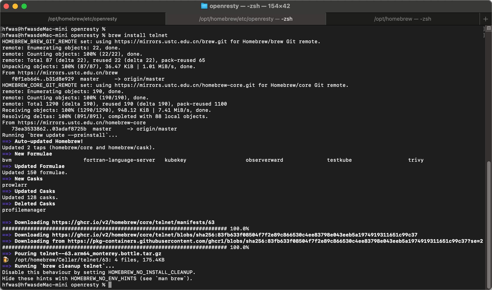
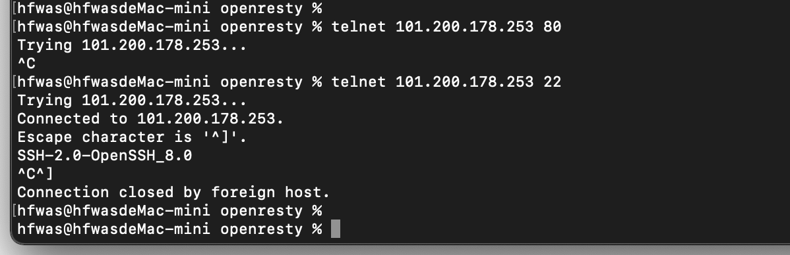

# homebrew安装telnetm命令

- 终端执行`brew install telnet`
- 截图如下：



- 代码如下：

```bash
hfwas@hfwasdeMac-mini openresty % brew install telnet
HOMEBREW_BREW_GIT_REMOTE set: using https://mirrors.ustc.edu.cn/brew.git for Homebrew/brew Git remote.
remote: Enumerating objects: 22, done.
remote: Counting objects: 100% (22/22), done.
remote: Total 87 (delta 22), reused 22 (delta 22), pack-reused 65
Unpacking objects: 100% (87/87), 36.47 KiB | 1.01 MiB/s, done.
From https://mirrors.ustc.edu.cn/brew
   f0f1eb6d4..b31d8e929  master     -> origin/master
HOMEBREW_CORE_GIT_REMOTE set: using https://mirrors.ustc.edu.cn/homebrew-core.git for Homebrew/core Git remote.
remote: Enumerating objects: 190, done.
remote: Counting objects: 100% (190/190), done.
remote: Total 1290 (delta 190), reused 190 (delta 190), pack-reused 1100
Receiving objects: 100% (1290/1290), 948.12 KiB | 7.41 MiB/s, done.
Resolving deltas: 100% (891/891), completed with 88 local objects.
From https://mirrors.ustc.edu.cn/homebrew-core
   73ea3533862..03adaf8725b  master     -> origin/master
Running `brew update --preinstall`...
==> Auto-updated Homebrew!
Updated 2 taps (homebrew/core and homebrew/cask).
==> New Formulae
bvm                       fortran-language-server   kubekey                   observerward              testkube                  trivy
==> Updated Formulae
Updated 150 formulae.
==> New Casks
prowlarr
==> Updated Casks
Updated 128 casks.
==> Deleted Casks
profilemanager

==> Downloading https://ghcr.io/v2/homebrew/core/telnet/manifests/63
######################################################################## 100.0%
==> Downloading https://ghcr.io/v2/homebrew/core/telnet/blobs/sha256:83fb633f08504f7f2e89c866530c4ee83798e043eeb5a1974919311651c99c37
==> Downloading from https://pkg-containers.githubusercontent.com/ghcr1/blobs/sha256:83fb633f08504f7f2e89c866530c4ee83798e043eeb5a1974919311651c99c37?se=2
######################################################################## 100.0%
==> Pouring telnet--63.arm64_monterey.bottle.tar.gz
🍺  /opt/homebrew/Cellar/telnet/63: 4 files, 175.4KB
==> Running `brew cleanup telnet`...
Disable this behaviour by setting HOMEBREW_NO_INSTALL_CLEANUP.
Hide these hints with HOMEBREW_NO_ENV_HINTS (see `man brew`).
hfwas@hfwasdeMac-mini openresty % 
```

# 测试

- 可以使用

