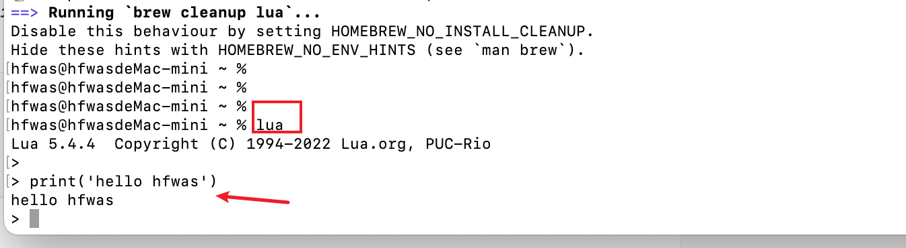

# homebrew安装lua

- 终端执行`brew install lua`

```bash
hfwas@hfwasdeMac-mini ~ % brew install lua
HOMEBREW_BREW_GIT_REMOTE set: using https://mirrors.ustc.edu.cn/brew.git for Homebrew/brew Git remote.
HOMEBREW_CORE_GIT_REMOTE set: using https://mirrors.ustc.edu.cn/homebrew-core.git for Homebrew/core Git remote.
Running `brew update --preinstall`...
==> Downloading https://ghcr.io/v2/homebrew/core/lua/manifests/5.4.4
######################################################################## 100.0%
==> Downloading https://ghcr.io/v2/homebrew/core/lua/blobs/sha256:801bc01f4821a3f69e7496a00d609d9669ac9f6cac0b7b5bfad540ca5c9317cc
==> Downloading from https://pkg-containers.githubusercontent.com/ghcr1/blobs/sha256:801bc01f4821a3f69e7496a00d609d9669ac9f6cac0b7b5bfad540ca5c9317cc?se=2022-0
######################################################################## 100.0%
==> Pouring lua--5.4.4.arm64_monterey.bottle.tar.gz
==> Caveats
You may also want luarocks:
  brew install luarocks
==> Summary
🍺  /opt/homebrew/Cellar/lua/5.4.4: 29 files, 795.1KB
==> Running `brew cleanup lua`...
Disable this behaviour by setting HOMEBREW_NO_INSTALL_CLEANUP.
Hide these hints with HOMEBREW_NO_ENV_HINTS (see `man brew`).
```

- 安装结束
- 测试是否安装成功，终端执行`lua`, 输入`print('hello hfwas')`，说明安装成功



