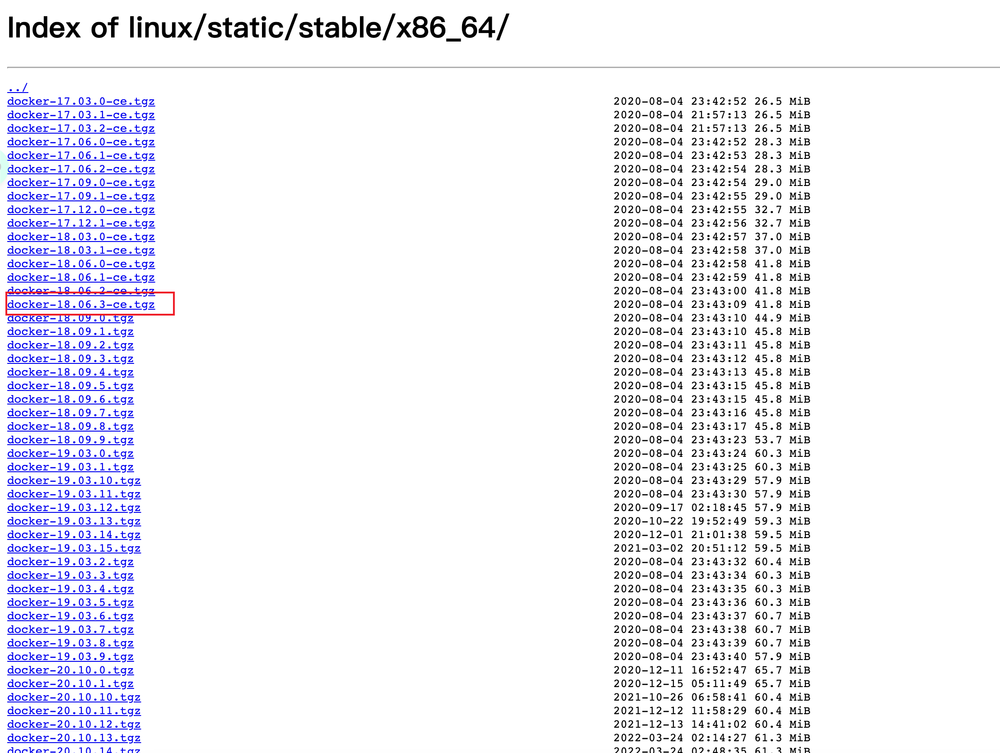

# 内网安装docker环境

- 在为期两天的部署过程当中遇到的一些问题和docker环境的部署的记录

# 防火墙

- 切记：首先关闭防火墙，不然容器访问会报错，血的教训！！！
- 执行`systemctl stop firewalld.service`
- 永久禁用防火墙，执行`systemctl disable firewalld.service`
- 如果是先安装的docker,再停止防火墙，切记要重启docker！！！！，执行`systemctl restart docker`

## 离线 - 内网环境

- 从`https://download.docker.com/linux/static/stable/x86_64/`下载docker压缩包



- 将文件解压，执行`tar -zxvf docker-18.06.3-ce.tgz`
- 将解压出来的文件复制到`/usr/bin`，执行`cp docker/** /usr/bin`
- 进入`/etc/systemd/system`，创建docker.service文件，插入以下内容

```bash
[Unit]
Description=Docker Application Container Engine
Documentation=https://docs.docker.com
After=network-online.target firewalld.service
Wants=network-online.target

[Service]
Type=notify
# the default is not to use systemd for cgroups because the delegate issues still
# exists and systemd currently does not support the cgroup feature set required
# for containers run by docker
ExecStart=/usr/bin/dockerd --selinux-enabled=false --insecure-registry=自己服务器IP
ExecReload=/bin/kill -s HUP $MAINPID
# Having non-zero Limit*s causes performance problems due to accounting overhead
# in the kernel. We recommend using cgroups to do container-local accounting.
LimitNOFILE=infinity
LimitNPROC=infinity
LimitCORE=infinity
# Uncomment TasksMax if your systemd version supports it.
# Only systemd 226 and above support this version.
#TasksMax=infinity
TimeoutStartSec=0
# set delegate yes so that systemd does not reset the cgroups of docker containers
Delegate=yes
# kill only the docker process, not all processes in the cgroup
KillMode=process
# restart the docker process if it exits prematurely
Restart=on-failure
StartLimitBurst=3
StartLimitInterval=60s

[Install]
WantedBy=multi-user.target
```

- 重新加载文件，执行`systemctl daemon-reload`
- 设置docker开机启动，执行`systemctl enable docker.service`
- 安装完毕，最后查看docker是否起来，执行`systemctl status docker`

# 安装docker-compose环境

## 离线 - 内网环境

- 从`https://github.com/docker/compose/releases/`选择对应的版本，下载压缩包


- 将下载下来的文件拷贝到`/usr/lcoal/bin`目录下，修改为docker-compose。执行`mv docker-compose-Linux-x86_64 /usr/local/bin/docker-compose`
- 赋予权限，执行`chmod 777 docker-compose`
- 执行`docker-compose version`，如果报错，显示未找到`docker-compose`命令
- 执行`ln -s /usr/local/bin/docker-compose /usr/bin/docker-compose`
  - 警告：不要使用相对地址，一定要使用绝对地址。血的教训！！！
  - ⚠️：如果看到软连接的目录或者命令显示红色，一直在跳动，说明没执行成功，或者执行的对象不存在，请检查命令
- 再次执行`docker-compose version`，就可以查看到docker-compose的版本了


