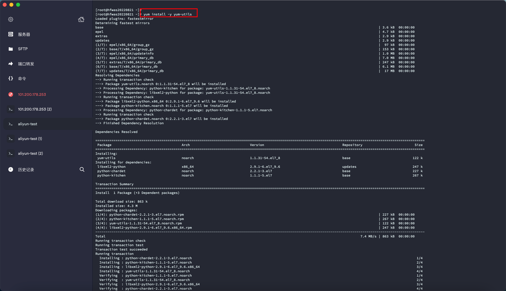
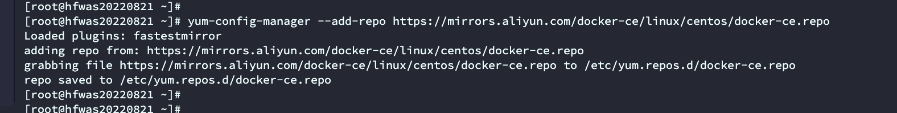
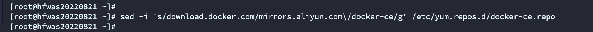
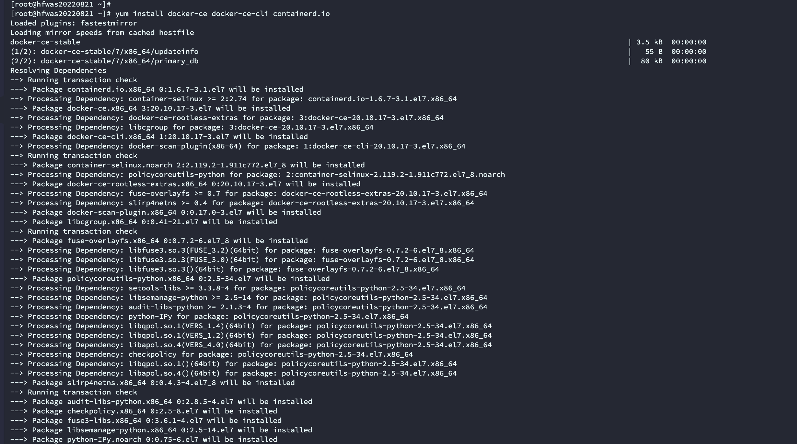
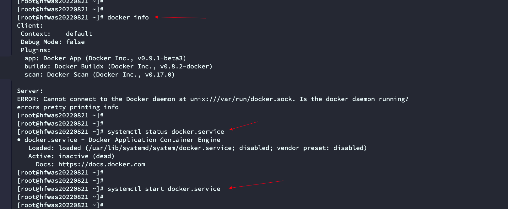
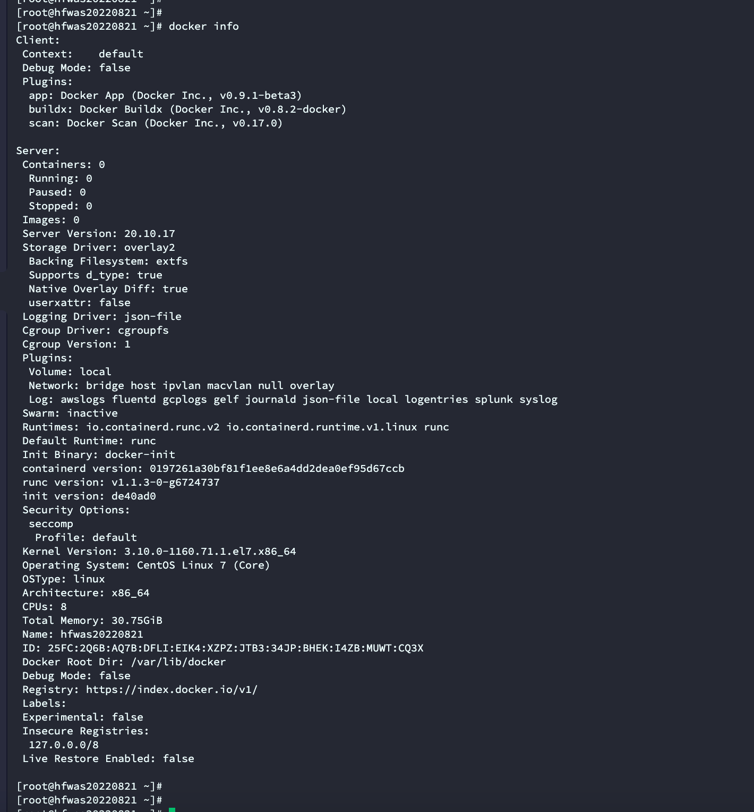

# 安装docker-外网

- 先执行`yum install -y yum-utils `

- 在执行`yum-config-manager --add-repo https://mirrors.aliyun.com/docker-ce/linux/centos/docker-ce.repo`

- 在执行`sed -i 's/download.docker.com/mirrors.aliyun.com\/docker-ce/g' /etc/yum.repos.d/docker-ce.repo`

- 在执行`yum install docker-ce docker-ce-cli containerd.io`

- 最后需要启动docker

- 执行`docker info`查看dock er信息

- 

