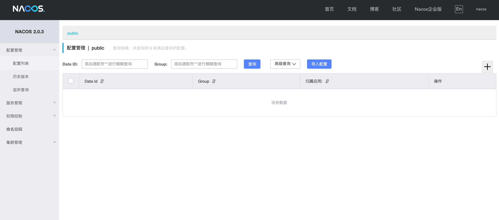

# m1安装nacos

- 下载na co s镜像，执行`docker pull zhusaidong/nacos-server-m1:2.0.3`

- 启动nacos，执行`docker run -d -p 8848:8848 --env MODE=standalone --name nacos zhusaidong/nacos-server-m1:2.0.3`

- 本地访问nacos，访问`http://127.0.0.1:8848/nacos/#/login`

- 进入nacos之后

- 