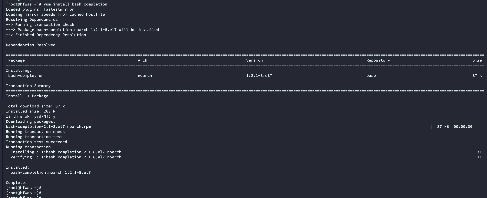
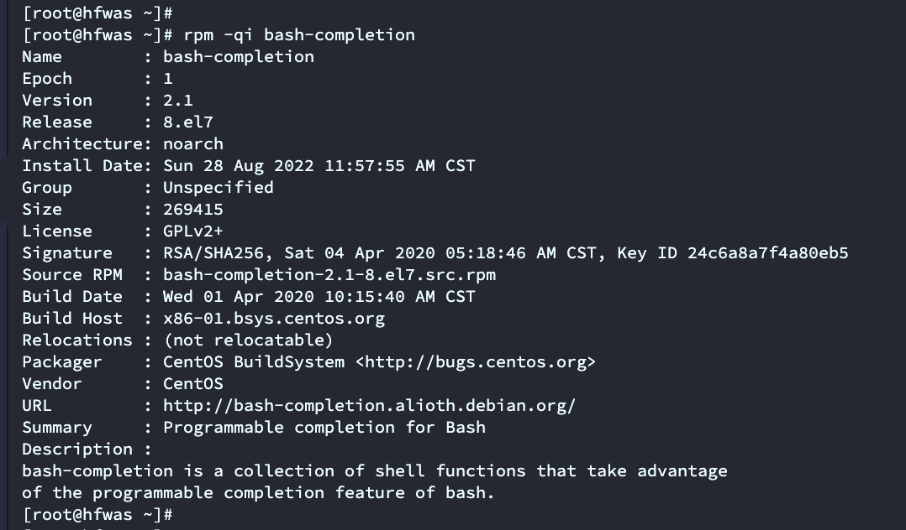
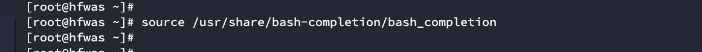
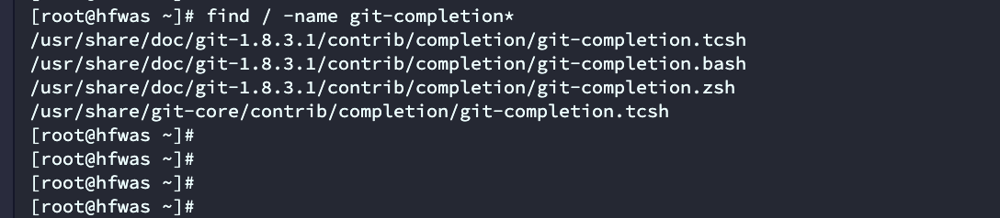
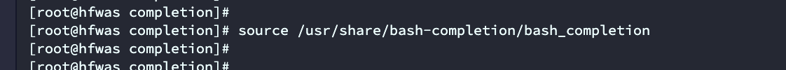
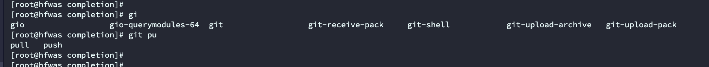

# linux命令自动补全

- 首先安装`yum install bash-completion `

- 查看版本信息，执行`rpm -qi bash-completion`

- 生效配置`source /usr/share/bash-completion/bash_completion `

- 再次测试docker命令，就可以看到会有自动补全了

## 后续安装

如果先安装的bash_completion，后安装的其他软件，比如git,k8s，不会有自动补全的效果

### git

- git安装之后会自带有

- 执行命令`source /usr/share/bash-completion/bash_completion`

- 然后就会有代码补全的效果了

- 