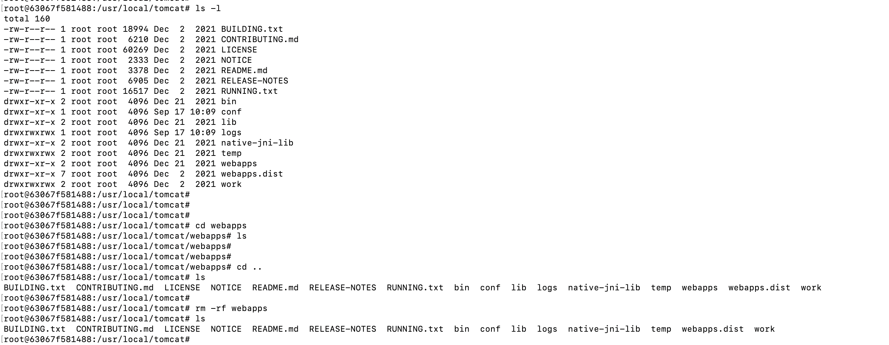
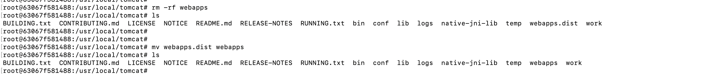
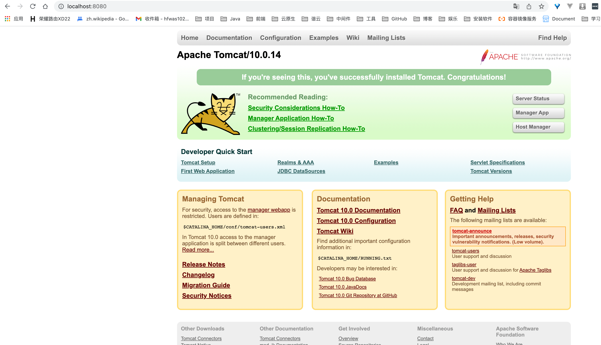

# m1安装tomcat

- 拉取镜像，执行命令`docker pull tomcat`

- 启动镜像，执行命令`docker run -d -p 8080:8080 tomcat`

- 本地访问，执行命令`http://localhost:8080/`

- 问题解决

  - 问题截图

  

  - 问题原因，

  

  - 问题解决
    - 将webapps删除，将webapps.dist文件夹名称修改为webapps

  

  - 测试截图

  

- 