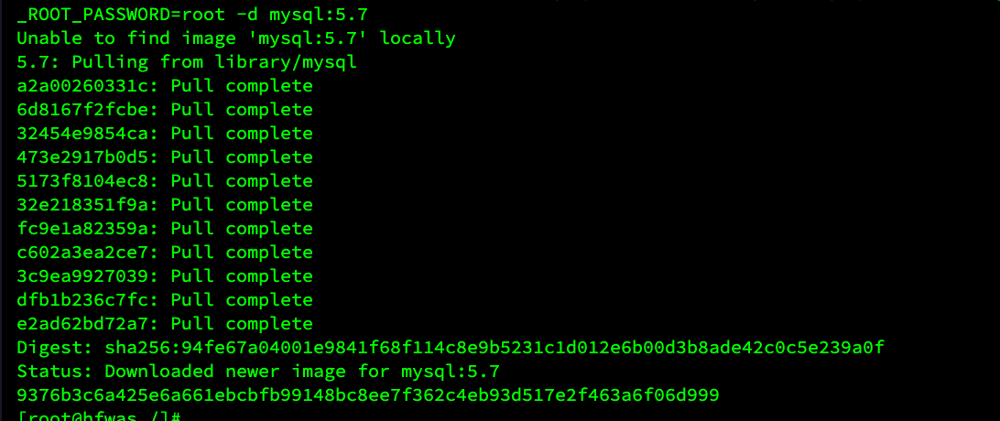
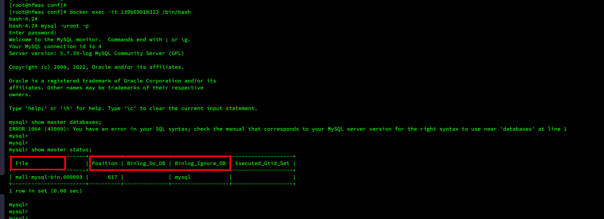
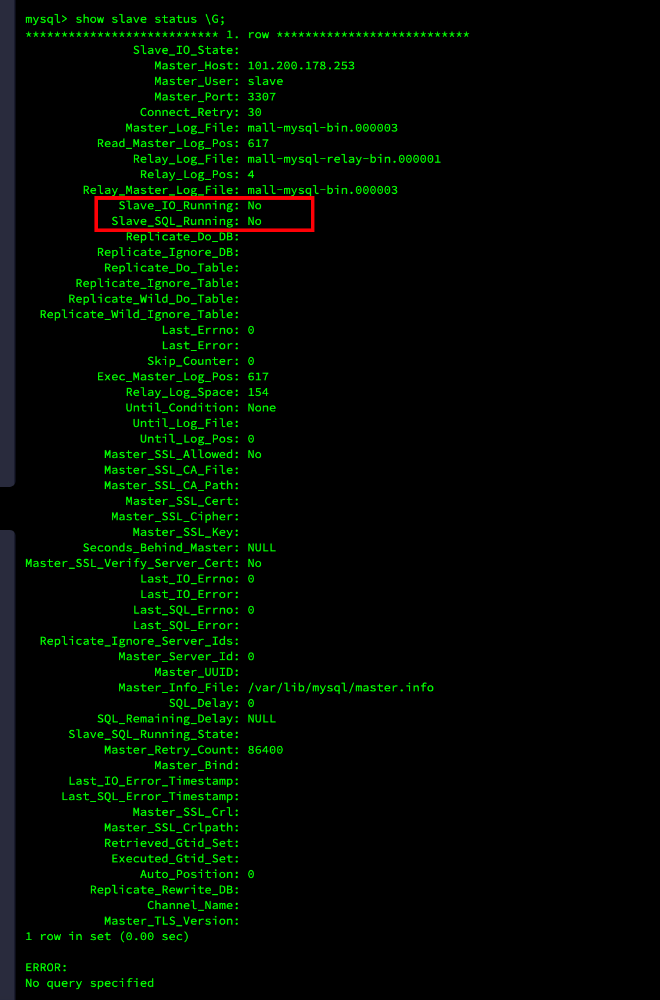
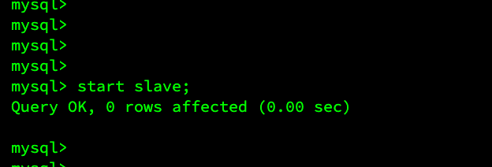
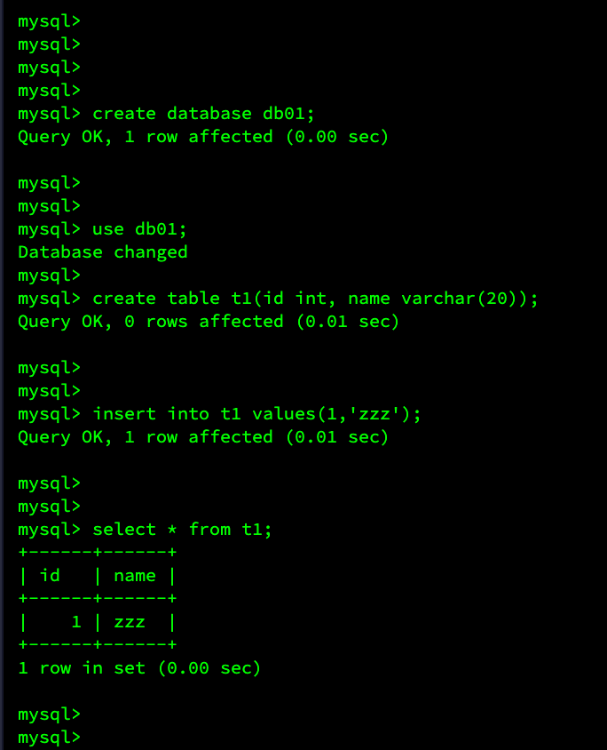
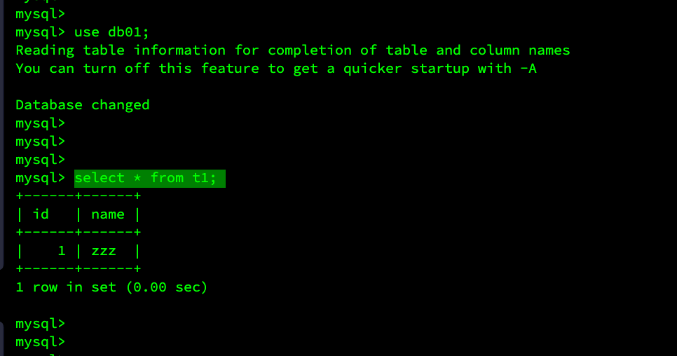

# mysql主从复制搭建

# 拉取mysql镜像

- 执行命令`docker pull mysql:5.7`




# 主库配置

## 新建配置文件

- 文件名称为：`my.cnf`

```
[mysqld]
## 设置server_id，统一局域网中需要唯一
server-id=101
## 指定不需要同步的数据库名称
binlog-ignore-db=mysql
## 开启二进制日志功能
log-bin=mall-mysql-bin
## 设置二进制日志使用内存大小（事务）
binlog_cache_size=1M
## 设置使用的二进制日志格式，(mixed,statement,row)
binlog_format=mixed
## 二进制日志过期清理时间，默认值为0；标识不自动清理
expire_logs_days=7
## 跳过著丛渎职中遇到的所有错误或指定类型的错误，避免slave端复制中断
## 如：1062错误是指一些主键重复，1032错误是因为著丛数据库数据不一致
slave_skip_errors=1062
```

## 启动容器

- 执行命令`docker run  --name mysql-cluster -p 3307:3306 -v /mydata/mysql-cluster/log:/var/log/mysql   -v /mydata/mysql-cluster/data:/var/lib/mysql  -v /mydata/mysql-cluster/conf:/etc/mysql/conf.d -e MYSQL_ROOT_PASSWORD=root -d mysql:5.7`

## 主库配置

- 创建用户，执行命令：`CREATE USER 'slave'@'%' IDENTIFIED BY '123456';`
- 用户授权，执行命令：`GRANT REPLICATION SLAVE,REPLICATION CLIENT ON *.* TO 'slave'@'%'s`
- 配置完成之后，重启主库，执行命令：`docker restart 主库容器id`

## 主库状态

- 执行`show master status;`



# slave库配置

## 启动从库

- 执行命令：`docker run  --name mysql-slave -p 3308:3306 -v /mydata/mysql-slave/log:/var/log/mysql   -v /mydata/mysql-slave/data:/var/lib/mysql  -v /mydata/mysql-slave/conf:/etc/mysql/conf.d -e MYSQL_ROOT_PASSWORD=root -d mysql:5.7`

## 添加配置文件

```
[mysqld]
## 设置server_id，统一局域网中需要唯一
server-id=102
## 指定不需要同步的数据库名称
binlog-ignore-db=mysql
## 开启二进制日志功能
log-bin=mall-mysql-slave1-bin
## 设置二进制日志使用内存大小（事务）
binlog_cache_size=1M
## 设置使用的二进制日志格式，(mixed,statement,row)
binlog_format=mixed
## 二进制日志过期清理时间，默认值为0；标识不自动清理
expire_logs_days=7
## 跳过著丛渎职中遇到的所有错误或指定类型的错误，避免slave端复制中断
## 如：1062错误是指一些主键重复，1032错误是因为著丛数据库数据不一致
slave_skip_errors=1062
## relay_log配置中继日志
relay_log=mall-mysql-relay-bin
## log_slave_updates表示slave将复制时间写进自己的二进制日志当中
log_slave_updates=1
## slave设置为只读
read_only=1
```

## 重启容器实例

- 执行命令：`docker restart 容器实例`

## 配置数据同步

- 执行命令：`change master to master_host='101.200.178.253',master_user='slave',master_password='123456',master_port=3307,master_log_file='mall-mysql-bin.000003',master_log_pos=617,master_connect_retry=30;`

## 查看从库状态

- show slave status \G;



## 开启主从同步

- 执行语句：`start slave;`



# 测试

## 主库

- 新建数据库，执行语句：`create database db01;`
- 使用数据库，执行语句：`use db01;`
- 新建表，执行语句：`create table t1(id int, name varchar(20));`
- 插入数据，执行语句：`insert into t1 values(1,'zzz');`



## 从库

- 查看数据表，执行语句：`select * from t1;`

