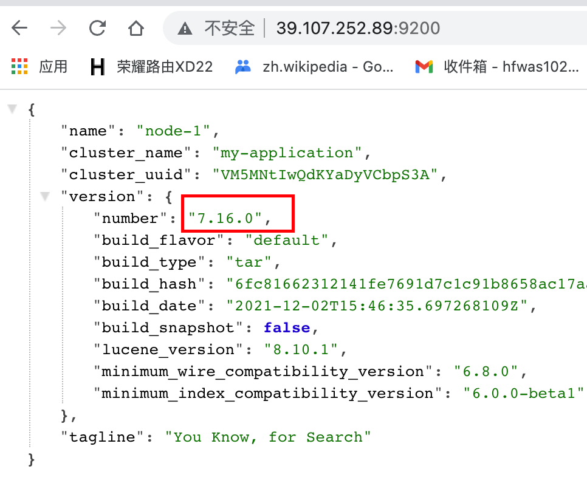

# es部署 - 阿里云

# 下载地址

- https://elasticsearch.cn/download/

# 总体步骤

# 详细操作

- 下载elasticsearch-7.16.0-linux-x86_64.tar.gz安装包
- 解压创建文件

```
tar -zxvf elasticsearch-7.16.0-linux-x86_64.tar.gz //解压压缩包 
cd elasticsearch-7.16.0 //进入目录 
mkdir data //创建data文件夹，保存数据
```

- 修改es配置文件

```
cluster.name: apm-application 
node.name: node-1 
path.data: /elasticsearch-7.16.0/data 
path.logs: /elasticsearch-7.16.0/logs 
# ES监听的ip地址 
network.host: 0.0.0.0 
cluster.initial_master_nodes: ["node-1"] 

# 需要开启跨域才能给elasticsearch-head，kibana等连接 
http.cors.enabled: true 
http.cors.allow-origin: "*" 
http.cors.allow-headers: Authorization,X-Requested-With,Content-Length,Content-Type
```

- 创建Elasticsearch启动用户，并设置权限等

```
# 创建用户组
groupadd elsearch
# 将用户添加到用户组当中，并且设置密码
useradd elsearch -g elsearch -p elasticsearch
# 给当前用户赋予elasticsearch-7.16.0文件夹的权限
chown -R elsearch:elsearch elasticsearch-7.16.0
```

- 修改linux设置

  - 执行`vim /etc/security/limits.conf`，添加如下内容vim /etc/security/limits.conf
    - 


  

  - 执行`vim /etc/sysctl.conf`，添加如下内容，添加完成之后，执行`sysctl -p `重启生效添加的配置
    - vm.max_map_count = 65535


  

- 切换至elsearch用户启动es

  - 进入elasticsearch-7.16.0文件夹。
  - 执行`su elsearch`，执行`./bin/elasticsearch -d`

- 查看是否启动成功：访问ip:9200,出现以下信息即为启动成功



# 重启es

- 执行`ps -ef | grep elsearch`


- 启动es，执行：


- 


# 问题记录

## maybe these locations are not writable or multiple nodes were started on the same data path?

- 因为已经启动了后台已经启动了es，需要先暂停后台的es，再次执行启动命令
- 执行`netstat -alnp | grep 9200`
- 再执行`kill -9 pid`


## 报错：`exception during geoip databases update`

报错详情：


解决办法：

- 在`elasticsearch.yml`当中添加一个配置，配置内容：`ingest.geoip.downloader.enabled: false`

## 访问前端，报错

报错信息：

- 这个报错是部署elasticsearch-8.4.0-linux-x86_64时候报的错，可以参考，
- 这次部署7.16版本当中并没有这个报错


解决办法：

- 在`elasticsearch.yml`当中吧`xpack.security.http.ssl:enabled` 设置成 `false` 即可
- 然后重启启动es

## 账号密码问题

- 这个报错是部署elasticsearch-8.4.0-linux-x86_64时候报的错，7.16版本部署没有遇到这个问题，可以参考，后续解决办法当中执行的命令在7.16版本当中也是没有的
- 执行`./bin/elasticsearch-setup-passwords interactive`


- 重新执行，重置密码，执行`./bin/elasticsearch-reset-password -u elastic`


## 启动检查报错

文字版：

```
[2022-10-17T10:24:21,230][ERROR][o.e.b.Bootstrap          ] [node-1] node validation exception
[1] bootstrap checks failed. You must address the points described in the following [1] lines before starting Elasticsearch.
bootstrap check failure [1] of [1]: initial heap size [1073741824] not equal to maximum heap size [2147483648]; this can cause resize pauses
```

图片展示：


解决办法：

- 修改config下的jvm.options当中的，修改成一样，如下图


## Cluster health status changed from [RED] to [YELLOW] (reason: [shards started 

具体截图：


详细解释：

- 链接地址：https://discuss.elastic.co/t/cluster-yellow-reason-shards-started-kibana-0/93034
- 截图：


## es7.16设置账号密码

- 执行`./bin/elasticsearch-setup-passwords interactive`


- 密码：

  | 类型                   | 账号名称               | 账号密码          |
  | ---------------------- | ---------------------- | ----------------- |
  | elastic                | elastic                | elastic123        |
  | apm_system             | apm_system             | apmsystem123      |
  | kibana_system          | kibana_system          | kibanasystem123   |
  | logstash_system        | logstash_system        | logstashsystem123 |
  | beats_system           | beats_system           | beats_system123   |
  | remote_monitoring_user | remote_monitoring_user | remote123         |


## 报错master not discovered yet, this node has not previously joined a bootstrapped (v7+) cluster, and this node must discover master-eligib

- 解决办法：在elas.yaml当中添加transport.tcp.port: 9301


- 

## 无法解析host

- 具体截图


- 参考：https://www.cnblogs.com/yb38156/p/15982583.html
- 

## IPv6 addresses must be bracketed

- 具体截图：


- 解决办法：


- 