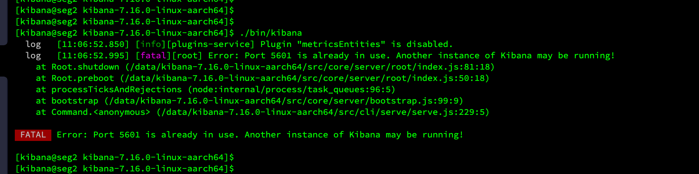

# kibana部署

# 大纲

[toc]

# 详细步骤

- 上传tar包，解压缩，执行` tar -zxvf kibana-7.16.0-linux-aarch64.tar.gz `


- 修改配置文件，


- 执行以下命令

```
groupadd kibana
useradd kibana -g kibana -p kibana
chown -R kibana:kibana   kibana-7.16.0-linux-aarch64 
```

- 进入`kibana-7.16.0-linux-aarch64/`文件夹当中，执行`su kibana`
- 执行`./bin/kibana > nohup.out 2> nohup.err < /dev/null &    `，让kibana后台启动，见下图：
  - 看到有status出现，在控制台紧接着输入exit即可。


- 


# 问题

## Error: Port 5601 is already in use. Another instance of Kibana may be running!



- 执行`netstat -alnp | grep 5601`
- 执行`kill -9 进程id`

## Kibana should not be run as root.  Use --allow-root to continue.

