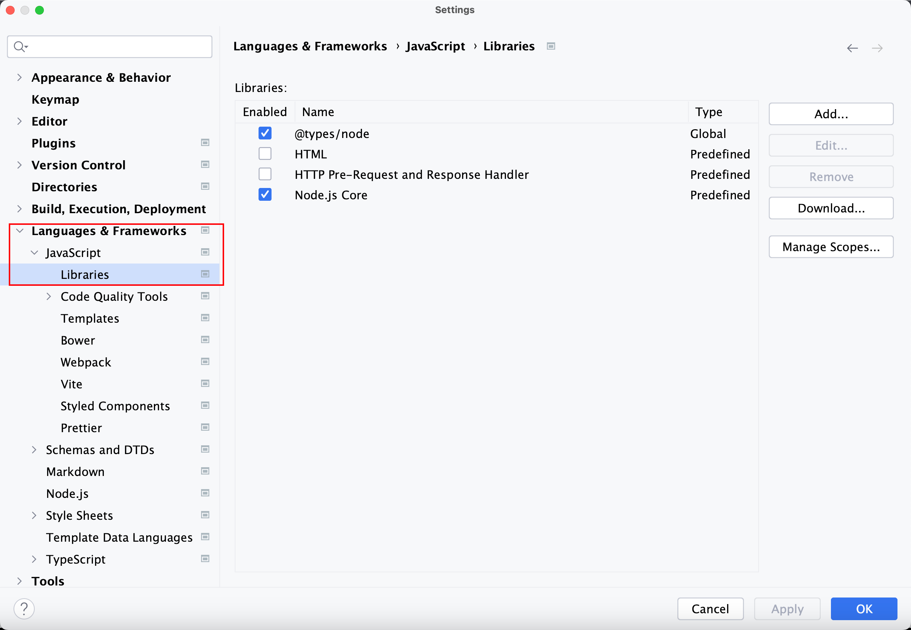
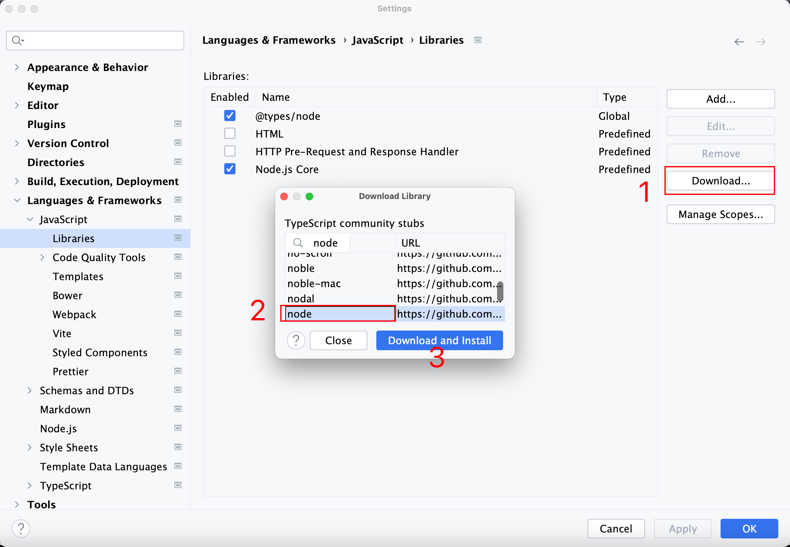
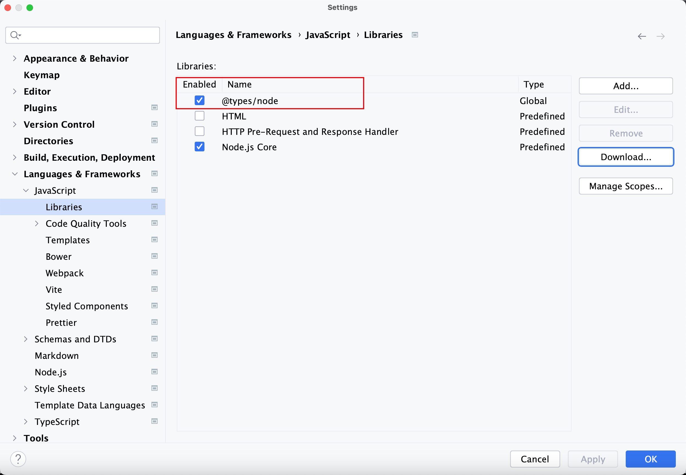

# webstorm当中nodejs代码无提示信息

- 写js文件时，使用fs.readfile，没有提示readfile方法，网上搜索了解决办法之后，成功解决了我的问题，特此记录
- 打开web storm，打开系统设置项。或者直接`commadn+,`
- 选择lan，选择javascript,

- 点击下载，筛选node，点击下载，选择打开即可。

- 效果图，在libraries当中打开@types/node就可以提示nodejs代码信息了。

